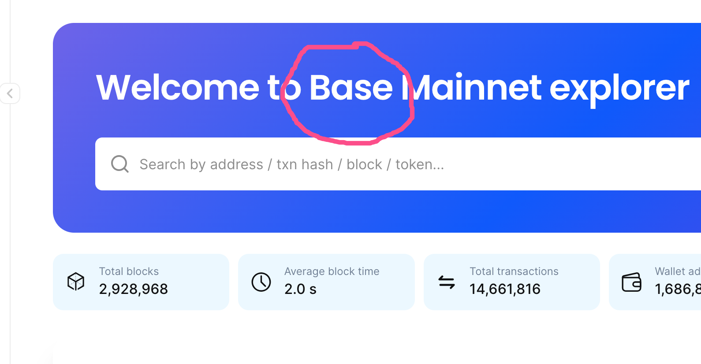
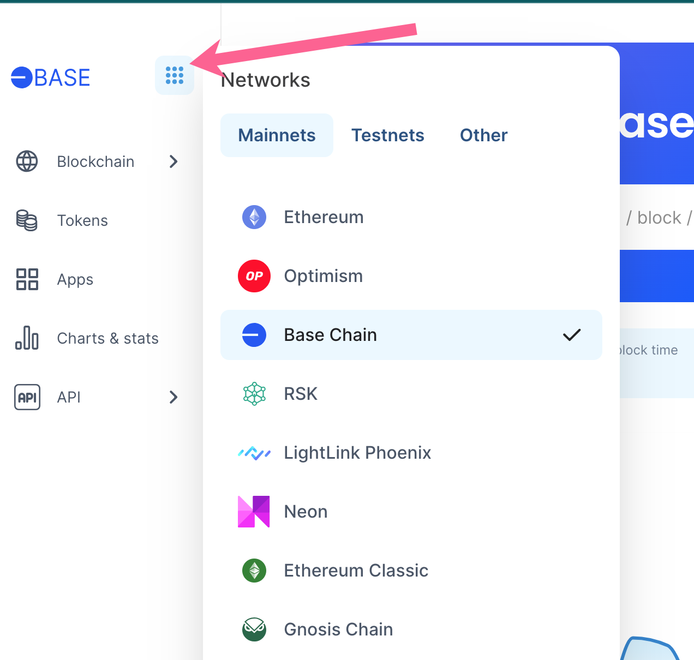
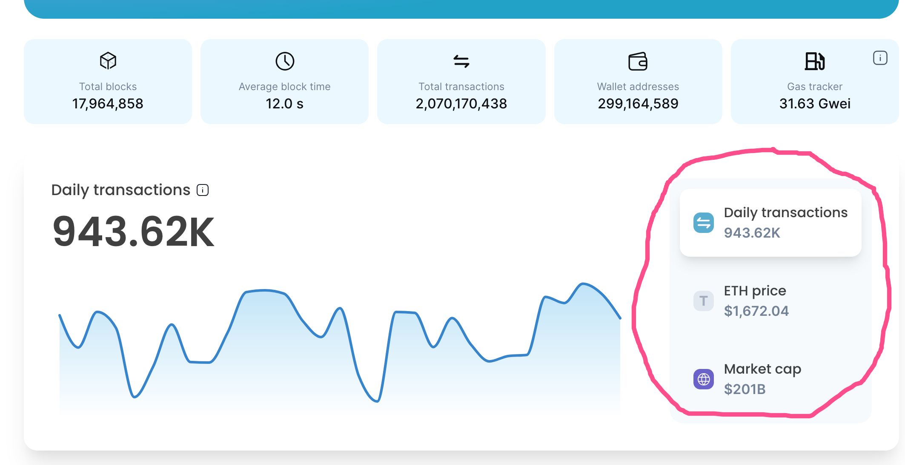
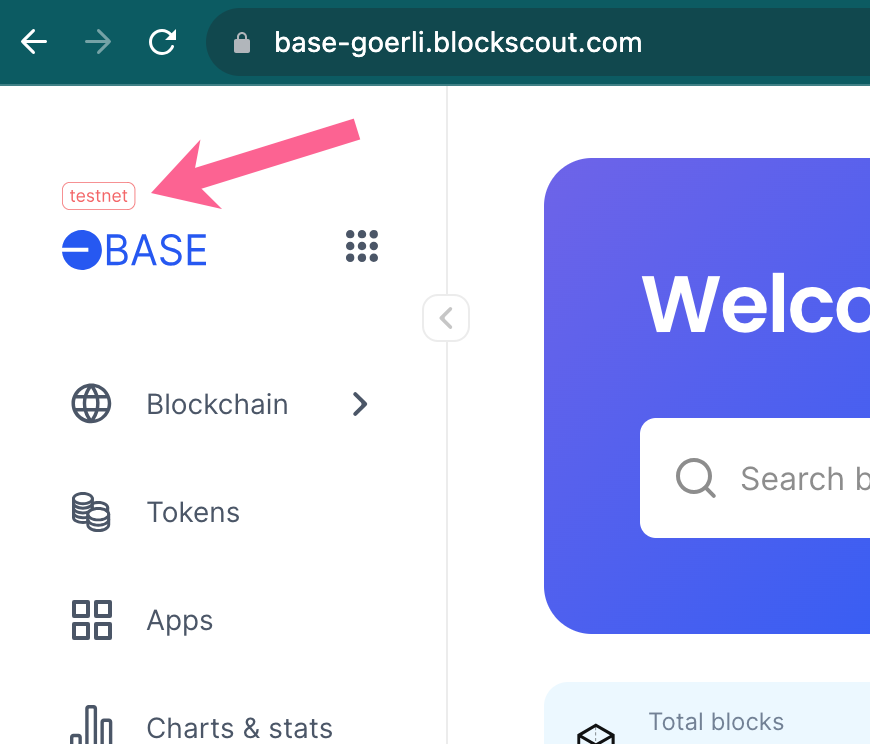

# Frontend ENVs: Common


The following are common frontend variables **only.**&#x20;

[Backend ENVs are available here.](../)



**->** [**Full list of ENVs**](https://github.com/blockscout/frontend/blob/main/docs/ENVS.md) with example values

**->** [**ENV File**](https://github.com/blockscout/frontend/blob/main/configs/envs/.env.eth) example


Below we describe information about common frontend variables, located at [`docker-compose/envs/common-frontend.env`](https://github.com/blockscout/blockscout/blob/master/docker-compose/envs/common-frontend.env). For a complete list along with example values and other information, please see the [full list of ENVs](https://github.com/blockscout/frontend/blob/main/docs/ENVS.md).

<table><thead><tr><th width="269.6666666666667">Variable</th><th width="103">Standard value</th><th>Info</th></tr></thead><tbody><tr><td>NEXT_PUBLIC_API_HOST</td><td>localhost</td><td>Host of the API backend. If you proxy the frontend and backend to the same url in the <code>.conf</code> file  you do not need to specify a port.</td></tr><tr><td>NEXT_PUBLIC_API_PROTOCOL</td><td>http</td><td>If you have ssl configured use <code>https</code>.</td></tr><tr><td>NEXT_PUBLIC_STATS_API_HOST</td><td><a href="http://localhost">http://localhost</a>: 8080</td><td><strong>Use the url</strong>  (not just the host) with the port where the stats service is running. This enables the stats menu item in the UI. If a value is not provided, the stats menu item does not appear.</td></tr><tr><td>NEXT_PUBLIC_NETWORK_NAME</td><td>&#x3C;network-name></td><td>String which shows the name of the network in the explorer. </td></tr><tr><td>NEXT_PUBLIC_NETWORK_ID</td><td>&#x3C;network-id></td><td>Needed to allow interactions with smart contracts -this is the standard chain ID. </td></tr><tr><td>NEXT_PUBLIC_NETWORK_RPC_URL</td><td>&#x3C;public_url></td><td>Also needed for smart contract interactions.</td></tr><tr><td>NEXT_PUBLIC_NETWORK_CURRENCY_NAME</td><td>&#x3C;full-currency-name> <em>ie Ether</em></td><td>Not used in UI, but is used when user adds the network to his wallet, e.g Metamask. <a href="https://docs.metamask.io/wallet/reference/rpc-api/#wallet_addethereumchain">More info</a>.</td></tr><tr><td>NEXT_PUBLIC_NETWORK_CURRENCY_SYMBOL</td><td>&#x3C;currency-abbreviation> <em>ie. ETH</em></td><td>Used in the UI to display the native currency name.</td></tr><tr><td>NEXT_PUBLIC_NETWORK_CURRENCY_DECIMALS</td><td>18</td><td>Currency decimals, 18 is standard.</td></tr><tr><td>NEXT_PUBLIC_API_BASE_PATH</td><td>/</td><td>Will usually remain as the base value. This can be changed to forward to a different path if running the old and new UI simultaneously.</td></tr><tr><td>NEXT_PUBLIC_FEATURED_NETWORKS</td><td>&#x3C;path-to-json-list></td><td>JSON list which populates this menu item</td></tr><tr><td>NEXT_PUBLIC_APP_HOST</td><td>localhost</td><td>Frontend UI host</td></tr><tr><td>NEXT_PUBLIC_APP_PROTOCOL</td><td>http</td><td>Frontend protocol</td></tr><tr><td>NEXT_PUBLIC_HOMEPAGE_CHARTS</td><td>"['daily_txs','coin_price','market_cap']"</td><td>Manages charts to display on homepage. Default is <code>daily_txs</code> only. </td></tr><tr><td>NEXT_PUBLIC_VISUALIZE_API_HOST</td><td><a href="http://localhost:8081">http://localhost:8081</a></td><td>Enables visualizer microservice. Chains can also use the Blockscout visualizer at <a href="https://visualizer.services.blockscout.com">https://visualizer.services.blockscout.com</a></td></tr><tr><td>NEXT_PUBLIC_IS_TESTNET</td><td>'true'</td><td>Sets <mark style="color:red;">testnet</mark> text if network is a testnet. </td></tr><tr><td>NEXT_PUBLIC_NETWORK_LOGO</td><td>&#x3C;path-to-image></td><td>Chain logo in <code>.svg</code> or <code>.png</code></td></tr><tr><td>NEXT_PUBLIC_NETWORK_ICON</td><td>&#x3C;path-to-image></td><td>Favicon in <code>.svg</code> or <code>.png</code></td></tr><tr><td>NEXT_PUBLIC_HOMEPAGE_PLATE_BACKGROUND</td><td>radial-gradient(103.03% 103.03% at 0% 0%, rgba(183, 148, 244, 0.8) 0%, rgba(0, 163, 196, 0.8) 100%), var(--chakra-colors-blue-400)</td><td>Background color for the homepage searchbar area. More info is available in the <a href="https://github.com/blockscout/frontend/blob/main/docs/ENVS.md">ENVs full documentation</a>. </td></tr><tr><td>NEXT_PUBLIC_HOMEPAGE_PLATE_TEXT_COLOR</td><td>"rgb(255, 255, 255)"</td><td>Color of text in the homepage background area.</td></tr><tr><td>NEXT_PUBLIC_API_WEBSOCKET_PROTOCOL</td><td>ws</td><td>set secure or non-secure websocket protocol.</td></tr><tr><td></td><td></td><td></td></tr></tbody></table>

Customize the UI of your running app instance (for example, homepage appearance, sidebar menu, and links in the footer) or enable certain features (like “My account’, “Marketplace”, “Blockchain interaction”, etc) by passing additional variables to your front-end container.  These can be passed during runtime, added to the docker container in the `environment:` list,  or changed within the `.env` file.


**->** [**Full list of ENVs**](https://github.com/blockscout/frontend/blob/main/docs/ENVS.md) with example values

**->** [**ENV File**](https://github.com/blockscout/frontend/blob/main/configs/envs/.env.eth) example


