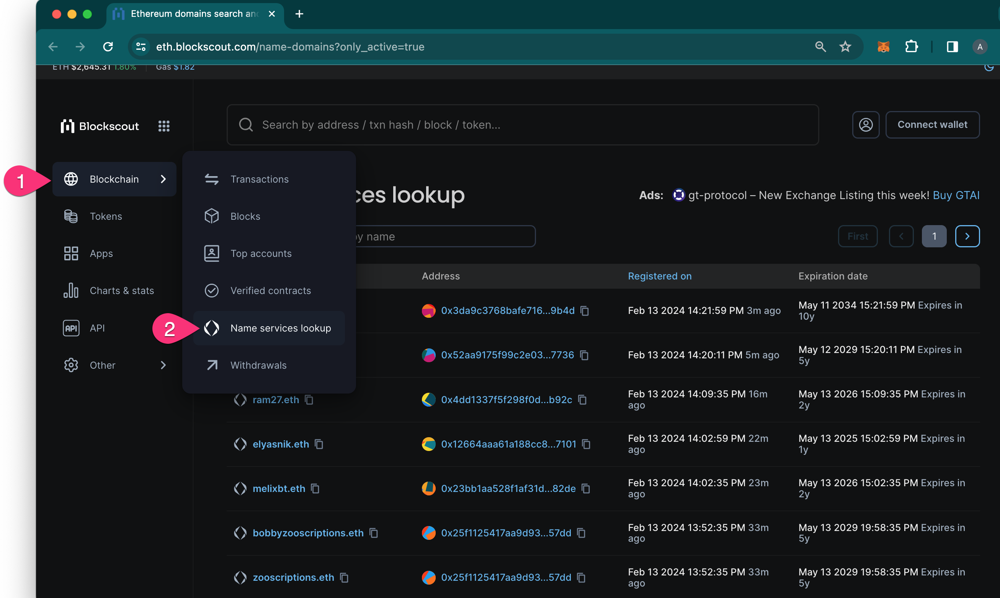
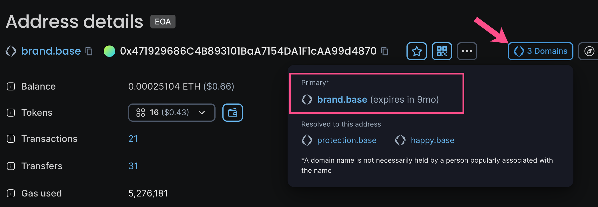

# Blockscout ENS (BENS) Name Service Integration

Blockscout now support Name Services for various chains including ENS for Ethereum. Search by name in the search bar or used the dedicated Name Services lookup page accessible from the Blockchain menu.

<figure><figcaption></figcaption></figure>

On the Name Services page search by name or address and view registration and expiration date for all names.

## Adding Name Service Support&#x20;

Protocols can add Name Service support for Blockscout instances on various chains. The BENS microservice was first introduced in [Blockscout v5.4](https://github.com/blockscout/blockscout/releases/tag/v5.4.0-beta), and several bugs were fixed in [**Blockscout v6.0**](https://github.com/blockscout/blockscout/releases/tag/v6.0.0-beta)**, which is the recommended minimum version for integration.**

You'll complete the following steps to add Name Service Support to Blockscout:

1. [Use this guide to create a subgraph](https://github.com/blockscout/blockscout-rs/blob/main/blockscout-ens/graph-node/subgraph-writer/README.md#howto-create-subgraph-for-your-domain-name-protocol). Our template uses the ENS subgraph structure, so the closer your project is the ENS the easier the integration.
   1. Subgraph should support [this graphql schema](https://github.com/blockscout/blockscout-rs/blob/main/blockscout-ens/graph-node/subgraphs/ens-subgraph/schema.graphql)
2. [Submit your subgraph](https://github.com/blockscout/blockscout-rs/blob/main/blockscout-ens/graph-node/subgraphs/README.md#deploy-subgraph-to-graph-node) to graph-node.
3. Submit a PR to the [blockscout-rs](https://github.com/blockscout/blockscout-rs/pulls) repository (hosted version) or integrate with your Blockscout fork.
   1. [Example PR for BNS](https://github.com/blockscout/blockscout-rs/pull/748) (Base Name Service)
4. Enable BENS service on the instance using the [`MICROSERVICE_BENS_ENABLED`](../env-variables/#blockscout-ens) & [`MICROSERVICE_BENS_URL`](../env-variables/#blockscout-ens) env variables.

### FAQs

Some domains are being indexed in a hashed format. What might cause this?

This may be the result of missing information/functions in the subgraph. When a subgraph sees that a domain name has been registered, it only has the `label_hash` of this name. Therefore, the subgraph has to guess the name using a rainbow table (make sure to load ens-rainbow table) OR find this name later in other events, such as `handleNameChanged` or any other event that has a name field.

Try to determine events with a name field, write code that will update domain name using `maybeSaveDomainName()` or other functions you prefer. For example, the ens-subgraph uses the `setNamePreimage` function, which performs the same  function for second-level-eth domains only.

**Reverse Records**

It may also be the case that unknown names are reverse records. These are not resolved by design, and users don't typically need to see them.&#x20;

How do I launch BENS locally?

The easiest way is to use docker.

`docker run --platform linux/x86_64 -p 8050:8050 --rm --name bens --env-file .env` [`ghcr.io/blockscout/bens:latest`](http://ghcr.io/blockscout/bens:latest)

To build locally without docker you should install `protoc` and `protoc-gen-openapiv2` . A complete guide for a local build is not yet available.

What does 'primary' refer to in the Domains dropdown in the Blockscout UI?

The primary name is the first name created which has not yet expired.

