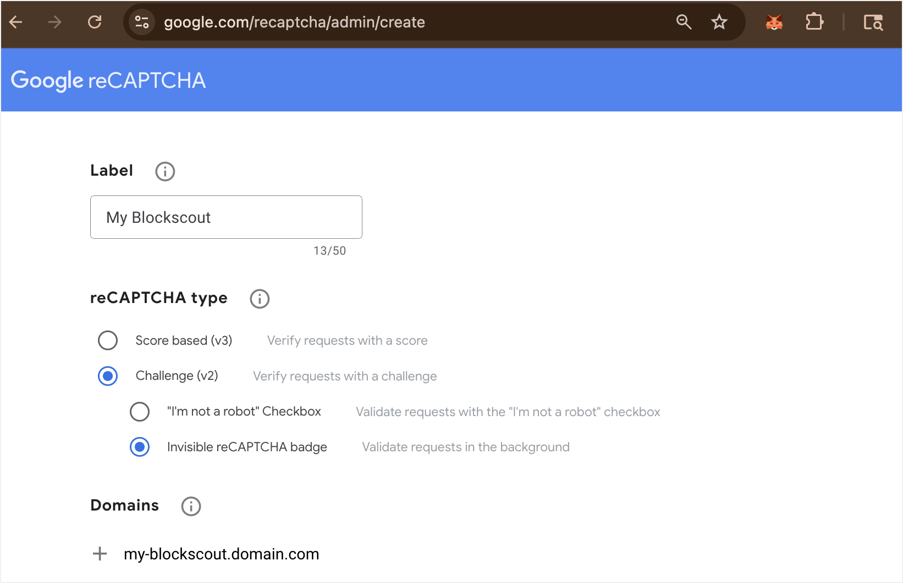
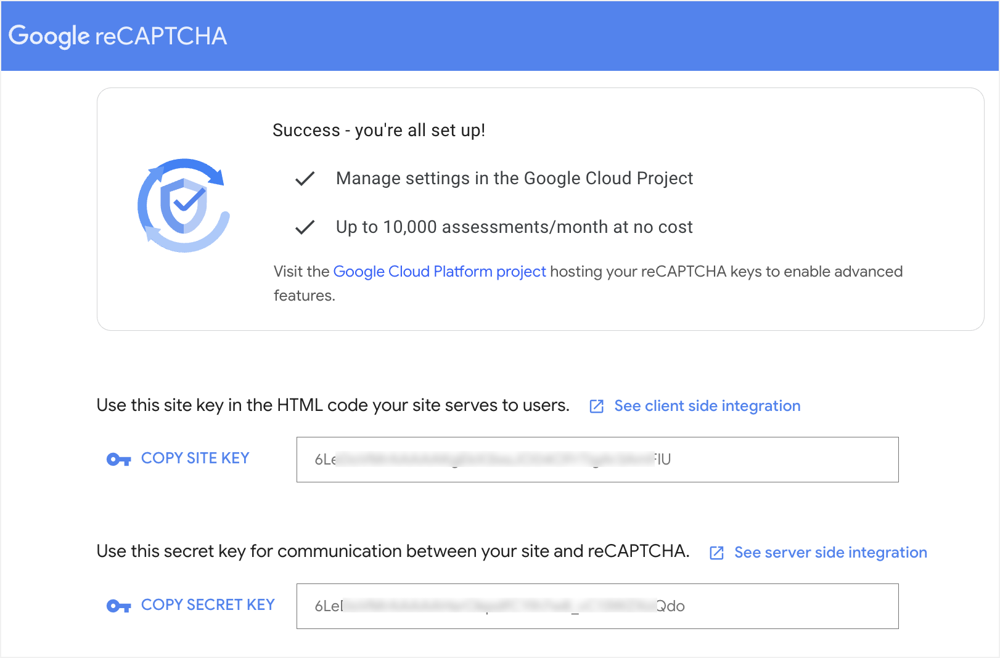

# reCAPTCHA


Blockscout currently supports **reCAPTCHA v2 in invisible mode.** Previous frontend versions (**v1.36.x)** support v3, but moving forward we will only support v2.&#x20;


reCAPTCHA from Google is a free service designed to protect your site from spam and bots.  It can be used in Blockscout to prevent bot activity related to CSV downloads and account validation.  reCAPTCHA is turned on by default, but can be disabled by setting `RE_CAPTCHA_DISABLED` to true.

### Obtain your keys

To use reCAPTCHA you will need a `CLIENT_KEY` (SITE KEY) and `SECRET_KEY`&#x20;

1. Go to [https://www.google.com/recaptcha/admin/create](https://www.google.com/recaptcha/admin/create), login to Google with an existing account, and fill in the following info:
   1. **Label**: Private label to identify the instance in your reCAPTCHA admin dashboard.
   2. **reCAPTCHA type**: Select Challenge (v2) and Invisible reCAPTCHA badge
   3. **Domains**: Enter your Blockscout domain. You can bypass this check later using an ENV, but enter here for setup.
   4. **Submit**

<figure><figcaption></figcaption></figure>

Copy your keys and use them with the following ENV variables to enable reCAPTCHA.

| ENV Variable            | reCAPTCHA key |
| ----------------------- | ------------- |
| `RE_CAPTCHA_CLIENT_KEY` | SITE KEY      |
| `RE_CAPTCHA_SECRET_KEY` | SECRET KEY    |

<figure><figcaption></figcaption></figure>


Once setup, you can view and update your settings on the reCAPTCHA admin dashboard at [https://www.google.com/recaptcha/admin](https://www.google.com/recaptcha/admin)


### Additional reCAPTCHA variables info

* Backend reCAPTCHA ENVs are located in the  Backend ENVs: Common page in the [CSV exports section](../env-variables/backend-env-variables.md#csv-export).
* Frontend  reCAPTCHA ENVs are located on the Frontend ENVs: Common -> ENVs page in the [External Services section](../env-variables/frontend-common-envs/envs.md#external-services-configuration).
* Disable reCAPTCHA by setting `RE_CAPTCHA_DISABLED` to true
* Disable checking reCAPTCHA domain names by setting `RE_CAPTCHA_CHECK_HOSTNAME` to true. **You must also turn off domain checking in the reCAPTCHA settings to enable this feature.** [More info](https://developers.google.com/recaptcha/docs/domain_validation)&#x20;
