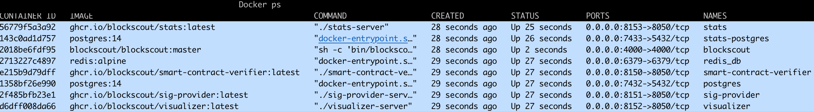

# Separate Frontend


This option is preferred if you want to modify the UI and/or have more control over the frontend.



You will use the [**`external-frontend.yml`**](https://github.com/blockscout/blockscout/blob/master/docker-compose/external-frontend.yml) file.


## Prerequisites

* Docker v20.10+
* Docker-compose 2.x.x+
* Running Ethereum JSON RPC client

Please see [https://github.com/blockscout/blockscout/tree/master/docker-compose](https://github.com/blockscout/blockscout/tree/master/docker-compose) for additional information

## Migration

### 1) Install frontend separately

Configure the app by passing the necessary environment variables when starting the Docker container.[ Information about ENVs is available here](../../env-variables/frontend-common-envs/).

```
docker run -p 3000:3000 --env-file <path-to-your-env-file> ghcr.io/blockscout/frontend:latest
```

Alternatively, you can build your own docker image and run your app using that container. Please follow this [guide](https://github.com/blockscout/frontend/blob/main/docs/CUSTOM\_BUILD.md).

### 2) Pull changes from the Blockscout master branch

We assume Blockscout is already deployed in your environment.

```
git pull origin master
```

### 3) Navigate to the docker compose folder

```
cd docker-compose
```

### 4) Adjust backend envs for your instance

Replace the example environment variables in the `external-frontend.yml` file.

<pre><code><strong>cat external-frontend.yml
</strong></code></pre>

By default, ENV variables are set to testing settings (anvil) in the `environment:` list. Replace with env vars from your existing backend. The only one you **NEED to keep** is **`API_V2_ENABLED='true'`** . Any values added here will override existing variables in your instance when you start the container.

<pre data-full-width="true"><code><strong>environment:
</strong>        ETHEREUM_JSONRPC_VARIANT: 'anvil'
        ETHEREUM_JSONRPC_HTTP_URL: http://host.docker.internal:8545/
        ETHEREUM_JSONRPC_WS_URL: ws://host.docker.internal:8545/
        INDEXER_DISABLE_INTERNAL_TRANSACTIONS_FETCHER: 'true'
        INDEXER_DISABLE_PENDING_TRANSACTIONS_FETCHER: 'true'
        DATABASE_URL: postgresql://postgres:@host.docker.internal:7432/blockscout?ssl=false
        ECTO_USE_SSL: 'false'
        SECRET_KEY_BASE: '56NtB48ear7+wMSf0IQuWDAAazhpb31qyc7GiyspBP2vh7t5zlCsF5QDv76chXeN'
        CHAIN_ID: '1337'
        API_V2_ENABLED: 'true'
        MIX_ENV: 'prod'
</code></pre>

### 4) Run docker compose with FRONT\_PROXY\_PASS variable.

You will pass in the frontend proxy url when running docker compose. The standard configuration for the frontend is `http://host.docker.internal:3000` but if you've made any changes pass in your url.

Run all containers (up) and run processes in the background (-d).

```
FRONT_PROXY_PASS=http://host.docker.internal:3000 docker compose -f external-frontend.yml up -d
```

Check progress and view containers:

```
Docker ps
```

You should see the following containers:

<figure><figcaption></figcaption></figure>

### 6) Check the proxy configuration

```
cd proxy
Cat default.conf.template
```

Unless you overrode the default configs (or did not provide the `FRONT_PROXY_PASS` variable) , you will see the default port for the backend default is 4000, and 3000 for the frontend.

However, with the proxy setup the whole application will default to port 80 (which is just localhost). Your instance should now be served on localhost. [More details about the recommended proxy setup](proxy-setup.md).


It may take several minutes for the frontend to propagate during this process.


### 7) Adjust frontend ENVs if needed

There are several required ENVs for the frontend. If required variables are missing or invalid the frontend will show in error message and will not run the app.

* The common list of [frontend ENVs and descriptions](../../env-variables/frontend-common-envs/).
* A detailed list with all available ENVs is in the [frontend repo folder.](https://github.com/blockscout/frontend/blob/main/docs/ENVS.md)

To adjust, stop the frontend container, update the env file (or pass variables directly), and restart the container.

### 8) Check Microservice ENVs

Typically the default values will provide what you need for the [`common-visualizer.env`](https://github.com/blockscout/blockscout/blob/master/docker-compose/envs/common-visualizer.env), [`common-stats.env`](https://github.com/blockscout/blockscout/blob/master/docker-compose/envs/common-stats.env), and [`common-smart-contract-verifier.env`](https://github.com/blockscout/blockscout/blob/master/docker-compose/envs/common-smart-contract-verifier.env) files.

Note that in the `smart-contract-verifier.envs` the `SMART_CONTRACT_VERIFIER__SOLIDITY__FETCHER__LIST__LIST_URL` variable is different depending on your OS. The default is Linux, if you are running macOS or Windows be sure to comment out the appropriate variables.
