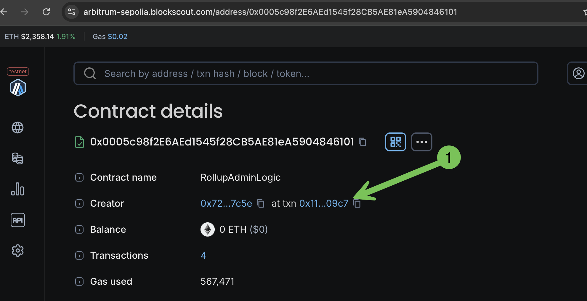
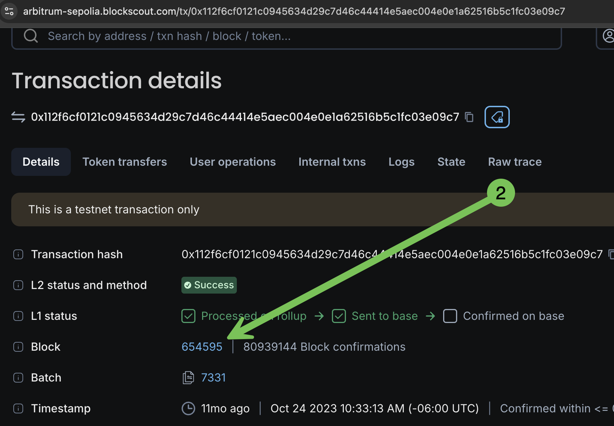
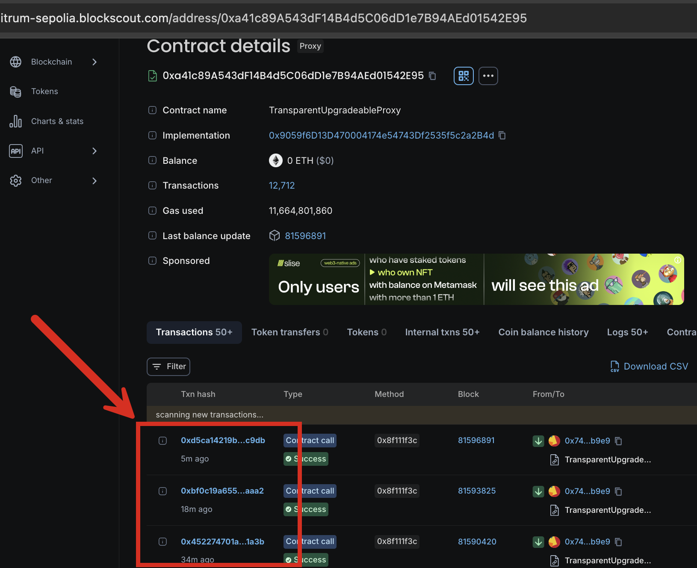

# Rollup Deployment

Follow the general [docker](docker-compose-deployment.md) or [manual](manual-deployment-guide/) instructions for deployment and include additional ENVs (starting with `CHAIN_TYPE`) as rollup deployments require different backend setups depending on the rollup type. Below we provide information and examples for [Arbitrum](rollup-deployment.md#arbitrum) and [Optimism](rollup-deployment.md#optimism).

## Arbitrum

Variables are linked below and supported with `CHAIN_TYPE=arbitrum.`Default values are set for many variables and typically do not need adjustment for common setups.


[Arbitrum environment variables](../env-variables/backend-envs-chain-specific.md#arbitrum-rollup-management)


Example configuration using Ethereum as the settlement layer:

```
INDEXER_ARBITRUM_ROLLUP_CHUNK_SIZE=20
INDEXER_ARBITRUM_L1_RPC=...
INDEXER_ARBITRUM_L1_RPC_HISTORICAL_BLOCKS_RANGE=1000
INDEXER_ARBITRUM_L1_RPC_CHUNK_SIZE=20
INDEXER_ARBITRUM_L1_ROLLUP_CONTRACT="..."
INDEXER_ARBITRUM_L1_ROLLUP_INIT_BLOCK=...
INDEXER_ARBITRUM_BRIDGE_MESSAGES_TRACKING_ENABLED='true'
INDEXER_ARBITRUM_MISSED_MESSAGES_RECHECK_INTERVAL=1h
INDEXER_ARBITRUM_TRACKING_MESSAGES_ON_L1_RECHECK_INTERVAL=30s
INDEXER_ARBITRUM_BATCHES_TRACKING_ENABLED='true'
INDEXER_ARBITRUM_BATCHES_TRACKING_RECHECK_INTERVAL=30s
INDEXER_ARBITRUM_NEW_BATCHES_LIMIT=1
INDEXER_ARBITRUM_CONFIRMATIONS_TRACKING_FINALIZED='true'
INDEXER_ARBITRUM_BATCHES_TRACKING_L1_FINALIZATION_CHECK_ENABLED='true'
```

### Arbitrum ENV Notes

#### `INDEXER_ARBITRUM_L1_RPC`&#x20;

Set to the settlement layer RPC node. In the case above (Ethereum settlement layer) it would be set to your choice of Ethereum RPC nodes such as [https://rpc.ankr.com/eth](https://rpc.ankr.com/eth) or another one of your choice [from this list](https://www.alchemy.com/chain-connect/chain/ethereum). If the rollup settles to a testnet, for example Arbitrum Sepolia, it would be set to [https://arbitrum-sepolia.blockscout.com/](https://arbitrum-sepolia.blockscout.com/) ( [info retrieved here](https://docs.arbitrum.io/build-decentralized-apps/reference/node-providers))

#### `INDEXER_ARBITRUM_L1_ROLLUP_INIT_BLOCK`&#x20;

Get this value using the block explorer for the settlement layer chain. Search the rollup contract address and find the transaction and block where the contract was deployed. Use that block number as the value for this env.&#x20;

<div>

<figure><figcaption></figcaption></figure>

 

<figure><figcaption></figcaption></figure>

</div>

#### `INDEXER_ARBITRUM_L1_RPC_HISTORICAL_BLOCKS_RANGE`

The RPC historical blocks range depends on the following factors:

* Batch production rate for the rollup. This can be identified by looking at how fast the `SequencerInbox` contract is called using the method `addSequencerL2BatchFromOrigin`. The transactions to the contract can be found on the contract page of the block explorer.

<figure><figcaption></figcaption></figure>

* Block production rate for the settlement layer.
* The limits of the L1 RPC node. Specifically, the maximum block range for the `eth_getLogs` operation is needed. This can be identified empirically or by contacting the node admin.

**Recommendations based on these factors:**

1. If the block production rate on the settlement layer is low (like one block per 12 secs for Ethereum Mainnet), choose a block range that covers 1 or 2 batches.
2. If the block production rate is high (if another rollup is used as a settlement layer), look at the minimum amount of settlement layer blocks produced during the time required to produce 2 rollup batches and the block range limit to retrieve logs from the L1 RPC node. For example, if 5000 settlement layer blocks are produced during the time when two subsequent batches are sent to the settlement layer and the RPC node block range limit is 3000, the smaller 3000 value should be used.

#### `INDEXER_ARBITRUM_BATCHES_TRACKING_RECHECK_INTERVAL` `INDEXER_ARBITRUM_TRACKING_MESSAGES_ON_L1_RECHECK_INTERVAL`

Tracking intervals depend on the block production rate on the settlement layer. Do not set them lower than the average block time. Higher values will cause latency in batches/messages identification. The default for L1 batches and messages re-check is 20 seconds.

#### `INDEXER_ARBITRUM_ROLLUP_CHUNK_SIZE` `INDEXER_ARBITRUM_L1_RPC_CHUNK_SIZE`

Chunk sizes depend on the RPC nodes' rate limits. Larger chunks may cause rate limit errors and smaller chunks introduce additional network-related delays.`INDEXER_ARBITRUM_ROLLUP_CHUNK_SIZE` configures the chunk size for the rollup RPC node and`INDEXER_ARBITRUM_L1_RPC_CHUNK_SIZE` configures the chunk size for the settlement layer (L1) RPC node.

#### `INDEXER_ARBITRUM_BATCHES_TRACKING_MESSAGES_TO_BLOCKS_SHIFT`


The only chain identified so far where this variable is required is the **Arbitrum One** chain.


This variable must be configured for chains where the message counters in the call `addSequencerL2BatchFromOrigin` of the `SequencerInbox` contract do not correspond directly to the rollup block numbers.&#x20;

## Optimism

Variables are linked below and supported with `CHAIN_TYPE=optimism.` Default values are set for many variables and typically do not need adjustment for common setups.


[Optimism environment variables](../env-variables/backend-envs-chain-specific.md#optimism-rollup-management)


Example configuration using Ethereum as the settlement layer (includes defaults)

```
INDEXER_OPTIMISM_L1_RPC=...
INDEXER_OPTIMISM_L1_SYSTEM_CONFIG_CONTRACT=...
INDEXER_OPTIMISM_L1_BATCH_BLOCKSCOUT_BLOBS_API_URL=https://eth.blockscout.com/api/v2/blobs
INDEXER_OPTIMISM_L1_BATCH_CELESTIA_BLOBS_API_URL=...
INDEXER_OPTIMISM_L1_BATCH_BLOCKS_CHUNK_SIZE=4
INDEXER_OPTIMISM_L2_BATCH_GENESIS_BLOCK_NUMBER=0
INDEXER_OPTIMISM_L1_OUTPUT_ORACLE_CONTRACT=... //omit if FaultProofs upgrade is on chain
INDEXER_OPTIMISM_L1_DEPOSITS_BATCH_SIZE=500
INDEXER_OPTIMISM_L1_DEPOSITS_TRANSACTION_TYPE=126
INDEXER_OPTIMISM_L2_WITHDRAWALS_START_BLOCK=1
INDEXER_OPTIMISM_L2_MESSAGE_PASSER_CONTRACT=0x4200000000000000000000000000000000000016

//required if INDEXER_OPTIMISM_L1_BATCH_BLOCKSCOUT_BLOBS_API_URL is set
INDEXER_BEACON_RPC_URL=...
INDEXER_BEACON_BLOB_FETCHER_REFERENCE_SLOT=8500000
INDEXER_BEACON_BLOB_FETCHER_REFERENCE_TIMESTAMP=1708824023
INDEXER_BEACON_BLOB_FETCHER_SLOT_DURATION=12
```

### Optimism ENV Notes

#### `INDEXER_OPTIMISM_L1_SYSTEM_CONFIG_CONTRACT`&#x20;

Address of SystemConfig smart contract that contains most of the configuration parameters used by the OP fetcher modules. The address is usually found in the chain's online docs. If there are no docs available, ask the chain's team for the SystemConfig contract address.

#### `INDEXER_OPTIMISM_L1_BATCH_BLOCKSCOUT_BLOBS_API_URL`

If the OP chain uses EIP-4844 blobs as data storage, this env is required. If this is the case, the following envs must also be defined:&#x20;

* `INDEXER_BEACON_RPC_URL`
* `INDEXER_BEACON_BLOB_FETCHER_REFERENCE_SLOT`
* `INDEXER_BEACON_BLOB_FETCHER_REFERENCE_TIMESTAMP`
* `INDEXER_BEACON_BLOB_FETCHER_SLOT_DURATION`

These envs are used by the batch indexing module as a fallback source of blob data and for retrieving the blob data in realtime from L1.  These values should be used for the following L1s. If clarification is needed please contact the Blockscout team.

```
// Ethereum Mainnet
INDEXER_BEACON_BLOB_FETCHER_REFERENCE_SLOT=8500000
INDEXER_BEACON_BLOB_FETCHER_REFERENCE_TIMESTAMP=1708824023
INDEXER_BEACON_BLOB_FETCHER_SLOT_DURATION=12

// Sepolia
INDEXER_BEACON_BLOB_FETCHER_REFERENCE_SLOT=4400000
INDEXER_BEACON_BLOB_FETCHER_REFERENCE_TIMESTAMP=1708533600
INDEXER_BEACON_BLOB_FETCHER_SLOT_DURATION=12

// Holesky
INDEXER_BEACON_BLOB_FETCHER_REFERENCE_SLOT=1000000
INDEXER_BEACON_BLOB_FETCHER_REFERENCE_TIMESTAMP=1707902400
INDEXER_BEACON_BLOB_FETCHER_SLOT_DURATION=12
```

#### `INDEXER_OPTIMISM_L2_BATCH_GENESIS_BLOCK_NUMBER`

Typically found in the [superchain registry](https://github.com/ethereum-optimism/superchain-registry/blob/main/superchain/configs/configs.json) in superchains.chains\[i].genesis.l2.number, e.g. for OP Mainnet it is `105235063`.  For most new OP chains the value will be  `0` as these chains start with the BedRock upgrade activated from scratch.

#### `INDEXER_OPTIMISM_L1_OUTPUT_ORACLE_CONTRACT`

This contract's address can be found in chain's online docs. If there are no docs available, contact the chain for this information. This address is not needed (and can be ommitted) for OP chains that started with the [FaultProofs upgrade](https://docs.optimism.io/stack/protocol/fault-proofs/explainer) activated from the genesis block.

