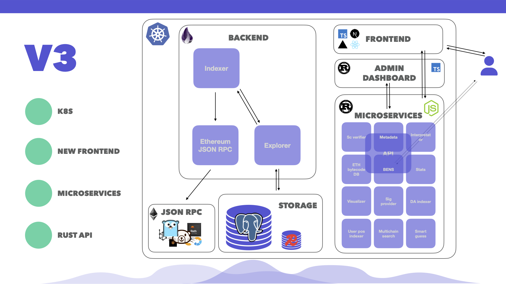

# Indexer Architecture Overview

<figure><figcaption></figcaption></figure>

## Presentation PDF

This presentation describes the past, present and future iterations of Blockscout along with details about how block imports work both synchonously and asynchronously, and a description of the regular and on-demand fetchers.


