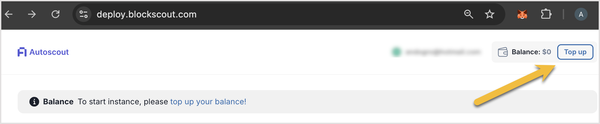
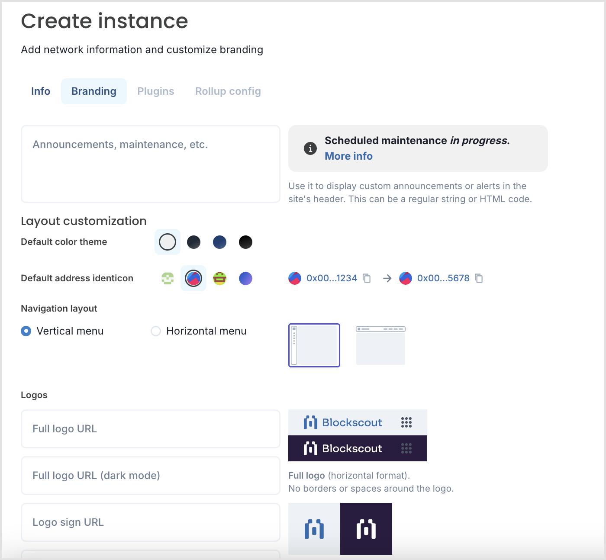

# Autoscout Explorer Launchpad

Autoscout is a self-service launchpad for chains and rollups looking to deploy an explorer quickly on hosted infrastructure. It is optimized for many chain types including Optimistic and Arbitrum Orbit rollups and zk rollups including Polygon zkEVM and zkSync.&#x20;


Autoscout is now available at [https://deploy.blockscout.com/](https://deploy.blockscout.com/)


### Get Started with Autoscout

1. **Create an account:** To get started, go to [https://deploy.blockscout.com/](https://deploy.blockscout.com/), create an account, and login to get started.
2. **Purchase credits:** You will need credits to launch your explorer. Purchase via Stripe with a credit card; a crypto option is coming soon. Credits are deducted in real time, see the pricing table below for costs.
   1. &#x20;If you are testing the service, you can request test credits in the [Blockscout Discord](https://discord.gg/blockscout) `#autoscout` channel. Share your email and request and we will top off your account for testing.&#x20;
3. **Add a new instance:** Click the Add instance button to get started.
4. **Add your network info**: See below for info on configuration and parameters.
5. **Deploy your explorer:** Click save and deploy to start the deployment process. In 5-10 minutes your explorer will be live and indexing your chain. Once deployed you can access your explorer link.

## Autoscout Pricing

Autoscout is a pay-as-you-go service. If your account runs out of credits your instance will be stopped until you top your account back up. If this happens, you will need to relaunch (and reindex) your instance once you add additional credits. Instances will scale based on daily transactions, so be sure to monitor and top up accordingly.

<figure><figcaption></figcaption></figure>

| Size                                   | Hourly | Daily | Weekly | Monthly |
| -------------------------------------- | ------ | ----- | ------ | ------- |
| 
xSmall brand new chain
       | .35    | 8.50  | 60     | 252     |
| 
Small &#x3C;50K tx per day
   | .485   | 12    | 84     | 349     |
| 
Medium &#x3C;150K tx per day
 | .972   | 24    | 168    | 700     |
| 
Large &#x3C;1M tx per day
    | 1.32   | 32    | 224    | 950     |

## Create Instance

There are several tabs to fill out to launch your instance; Info, Branding, and Rollup config (if needed). Plugins (currently the only live plugin is stats) can be added once your instance is fully indexed.&#x20;

You can edit parameters at any time, but this typically requires relaunching and reindexing the instance.

### Info

<figure><figcaption></figcaption></figure>

The following parameters are in the Info section. \* parameters are required.

* **Instance size\***: Select based on the number of transactions anticipated for the instance. The costs are currently placeholders, but your credits will be impacted according to chain usage.
* **Chain name**: The chain name will be shown in the top explorer banner.
* **Instance name\***: A label for your instance, it is reflected in the url of the instance ie https://instance-name.cloud.blockscout.com/
* **Chain ID**: If you don't know the chain ID you can get with the `eth_chainId` JSON-RPC method.
* **Node type:** Choose from the list of clients for the archive node:
  * Besu, Erigon, Anvil, Geth, Parity
* **Gas token symbol**: Will show in the interface, for example ETH if your chain uses Ether for gas.
* **Mainnet or Testnet**: Select the type of chain, if Testnet a label will be added to the instance.
* **This chain is a Rollup**: If selected, another field will appear to select **Arbitrum, Optimism, Polygon zkEVM or zkSync**. You will then fill out additional information in the Rollup Config tab.
* **HTTP RPC URL\***: The **archive node** url (https://your-rpc-url)\
  &#xNAN;_&#x4E;ote: archive node is required for internal transactions and token/coin historical balances._ [_Tracing should be enabled_](../setup/requirements/node-tracing-json-rpc-requirements.md) _for internal transactions._
* **WS URL**: The websocket url (wss://ws.your-websocket-url)
* **Chain spec URL**: URL to chain specification path json (Sepolia example: [chainspec.json](https://github.com/ethpandaops/ethereum-genesis-generator/blob/master/apps/el-gen/sepolia/chainspec.json) or [genesis.json](https://github.com/ethpandaops/ethereum-genesis-generator/blob/master/apps/el-gen/sepolia/genesis.json)). You will use the raw JSON file; in the Sepolia example this url is [https://raw.githubusercontent.com/ethpandaops/ethereum-genesis-generator/master/apps/el-gen/sepolia/chainspec.json](https://raw.githubusercontent.com/ethpandaops/ethereum-genesis-generator/master/apps/el-gen/sepolia/chainspec.json)&#x20;
* **Custom Domain**: You can use a custom domain for your instance but must configure your DNS and add a DNS `CNAME` record pointing to `autoscout.cname.blockscout.com`
* **Public RPC URL**: Enables 'add to MetaMask button'. Can be the same as the RPC URL if this is a public node.
* **WalletConnect project ID:** Enables the ability for Read and Write functionality with smart contracts. [Learn more about setting one up here](../setup/configuration-options/walletconnect-project-id-for-contract-read-write.md).

### Branding

<figure><figcaption></figcaption></figure>

* **Announcement banner:** Add an optional banner to the top of your instance, can include HTML code.
* **Default color theme**: Choose between a light theme and 3 variations of a darker theme.
* **Default address identicon:** Select from 4 different options for default identicons in your instance.
* **Vertical or Horizontal menu**: Select vertical for a side menu or horizontal for a top menu.
* **Full logo URL**: Add a url link to your full logo image in horizontal format. Supported formats: image/jpeg, image/gif, image/png. Add one for light mode and one for dark mode if desired (users can switch modes manually).
* **Logo sign (square) URL**: Add a url link to your square logo image in horizontal format. Supported formats: image/jpeg, image/gif, image/png. Add one for light mode and one for dark mode if desired (users can switch modes manually).
* **Header background gradient and text color**: Choose your desired background color gradients with the selector and choose your preferred text color. You will see a preview in the interface.
* **Favicon and OG image URL**: Add your favicon and [OG image](https://ogp.me/). OG image specs: Minimum image size is 200×20pixels (recommended: 1200×600); maximum supported file size is 8 MB; 2:1 aspect ratio; supported formats: image/jpeg, image/gif, image/png
* **OG description**: Add a description for Open Graph Previews
* **Enable enhanced OG tags**: Toggle if you want to render OG tags for API data pages
* **Enable enhanced SEO**: Toggle if you want to rerender page titles for Stats and Tokens pages to enhance SEO
* **API Navigation links**: Toggle to show/hide different API links in the navigation menu
* **Other Navigation links**: Add custom navigation links to the other section of the primary navigation menu
* **Footer links**: Add up to 3 columns along with titles and urls for the links you want added to each column.
* **Ads**: Select providers for Ads on your instance

### Rollup Config

If your chain is a rollup you will select this in the info screen and then fillout the associated Rollup config info.&#x20;


* Read the [Rollup deployment and config details](https://docs.blockscout.com/setup/deployment/rollup-deployment#arbitrum)
  * [Arbitrum](../setup/env-variables/backend-envs-chain-specific.md#arbitrum-management) ENV variables
  * [Optimism](../setup/env-variables/backend-envs-chain-specific.md#optimism-rollup-management) ENV variables
  * [Polygon zkEVM](https://docs.blockscout.com/setup/env-variables/backend-envs-chain-specific#polygon-zkevm-rollup-management) ENV variables
  * [zkSync](https://docs.blockscout.com/setup/env-variables/backend-envs-chain-specific#zksync-rollup-management) ENV variables


<figure><figcaption></figcaption></figure>

## FAQ

Why can't I see internal transactions?

There could be several reasons for this. Your RPC may not be an archive node and [tracing](../setup/requirements/node-tracing-json-rpc-requirements.md) may not be turned on for that node. Once you switch to an RPC with tracing enabled internal transactions will still not be indexed until you spin up a new instance. In this case you will need to shut down your instance and create a new one.

Is there an Autoscout API?

Yes, there is but it requires an API key to use. It can be useful if you are spinning up many instances or need to check on many instances at the same time. Contact us in Discord #autoscout channel to request an API key. \
\
See the API Swagger Docs for more info:\
\
[https://blockscout.github.io/swaggers/services/autoscout/main/index.html](https://blockscout.github.io/swaggers/services/autoscout/main/index.html)

