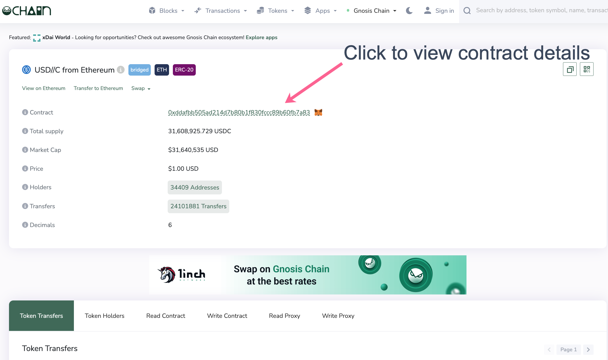
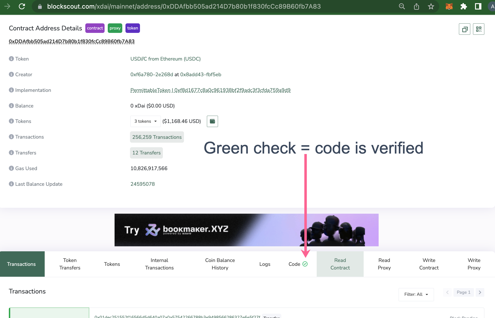
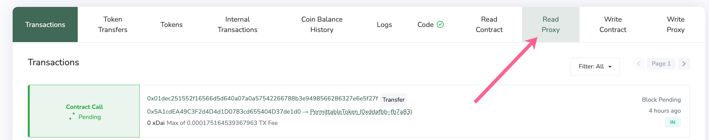
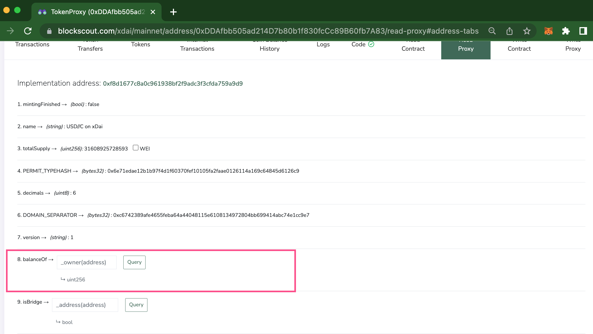
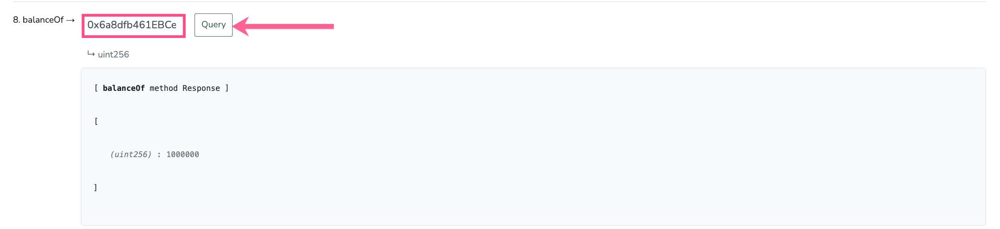
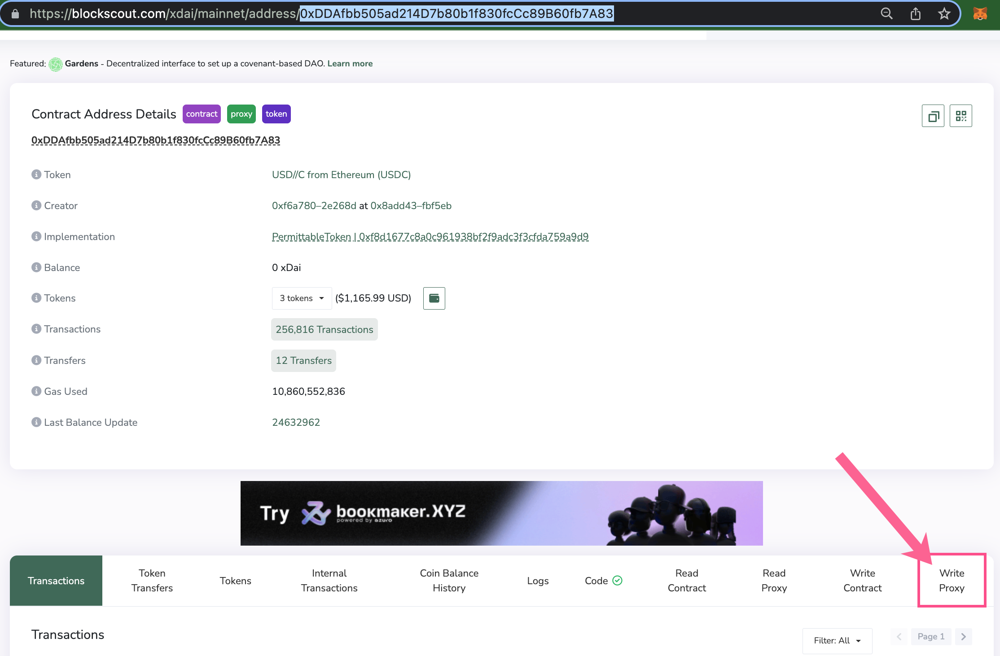
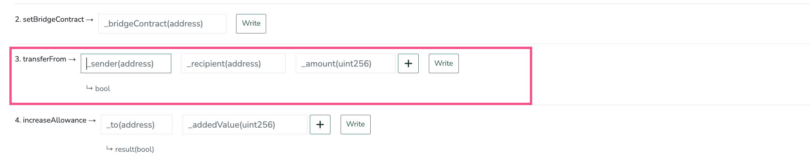
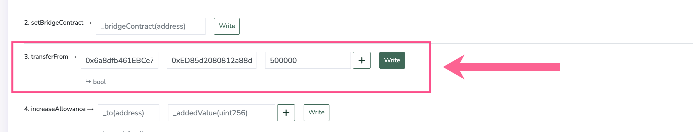
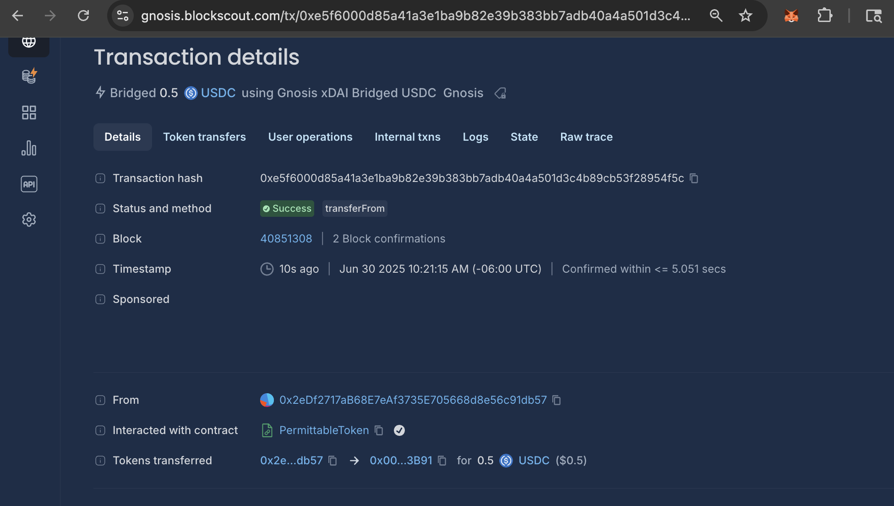

# Interacting with Smart Contracts

Once a contract is verified, contract methods are exposed and contract interaction is possible directly from Blockscout.


In the following examples we use Blockscout on Gnosis Chain. You can interact with verified contracts on any supported chain. Make sure your web3 wallet (like MetaMask) is also connected to that chain when reading / writing to a contract.


## Read Contract

Read actions let you check various contract attributes. You will need to connect a web3 wallet to make a query, though a query does not require a transaction or any gas costs.

1\) Find the contract address you want to interact with and enter into the search bar. In this example we search for USDC on Gnosis Chain.

<figure><figcaption>
Search bar results
</figcaption></figure>

2\) We select the first option in search and are taken to the token page. We can interact from here, but would prefer to see more information about the contract, so we click through to the contract page.

<figure><figcaption>
Read and Write methods are available, but we click on the Contract to see more.
</figcaption></figure>

3\) Scrolling down past the contract details we see the code is verified by the checkmark:white\_check\_mark:. If the code is not verified, it is not possible to read or write to a contract (unless a verified contract with the same bytecode is located in the Blockscout database. In this case read/write will also be available).

<figure><figcaption>
Code is verified
</figcaption></figure>

4\) We know this is a proxy implementation by the fact that there are options to either read/write to the contract or to the proxy. Proxy means that the contract is upgradeable, and the admin can set a new proxy address for the primary contract if upgrades are required.&#x20;

We will choose to **Read Proxy**, since it contains all the relevant methods for the current contract implementation.

<figure><figcaption>
Read proxy to find relevant methods. Read contract will only show implementation address.
</figcaption></figure>

5\) We can see the various methods within the proxy contract. Some show current values and others are queryable. An easy example to query is 8) `balanceOf` method.&#x20;

<figure><figcaption>
Scroll down to find balanceOf method
</figcaption></figure>

6\) This method expects an address and will output an integer. Simply paste in an 0x address and press **Query** to see the balance in USDC held by that particular address. If your web3 wallet is not connected at this point, you will be prompted to connect.

<figure><figcaption>
Query directly from Blockscout
</figcaption></figure>

The result shows this address holds 1,000,000 of the token, which converts to 1 USDC. _(Note ERC20 tokens allow for custom decimal point precision. USDC uses 6 decimal precision. Many others use 18 (to denote wei) so be sure to check the token implementation for conversion info)._

## Write Contract


Many write functions can only be performed by an approved owner. Connect the owner wallet when performing gated functions.&#x20;


1\) We'll use Blockscout to transfer 0.50 USDC from 1 address to another. You can perform this action directly through a wallet UI, we use the Blockscout interface here for demonstration purposes. \
\
See steps 1-3 above for accessing USDC on Gnosis Chain, or simply type the contract address (_0xDDAfbb505ad214D7b80b1f830fcCc89B60fb7A83_) into the search bar. Scroll down and select **Write Proxy**.

<figure><figcaption></figcaption></figure>

2\) We scroll down to find the `transferFrom` method.

<figure><figcaption>
Empty fields with prompts
</figcaption></figure>

Boxes are filled with the following information:

1. `_sender(address)`: The `0x` address sending the USDC. Note this account is the one to connect to Blockscout to write to the contract.
2. `_recipient(address)`: The `0x` address receiving the USDC.
3. `_amount(uint256)`: Amount to transfer. We use 6 decimals of precision for USDC - for other tokens this can differ. Here we enter 500000 to denote $0.50.

<figure><figcaption>
Filled fields
</figcaption></figure>

3\) We press the **Write** button, and MetaMask or another web3 wallet takes us through the transaction. If a wallet is not connected, there will be several prompts to connect an account to Blockscout. Once connected, we confirm the transaction.&#x20;


The connected wallet must contain enough native tokens (in this case xDai) to pay gas for the transaction.


<figure><figcaption></figcaption></figure>

4\) We can check our wallet to confirm the transaction, and can view tx details in Blockscout (or return to the [Read Contract](interacting-with-smart-contracts.md#read-contract) `balanceOf` method to view new balances for the addresses).

<figure><figcaption></figcaption></figure>

Transaction hash: [0x2c93c4e6618b30c552b95ce2eef16b6e663d99aa2f4a8ea55a70b693de70f113](https://gnosis.blockscout.com/tx/0x2c93c4e6618b30c552b95ce2eef16b6e663d99aa2f4a8ea55a70b693de70f113)

<figure><figcaption></figcaption></figure>

