# Merits

## What are Merits?


To learn details about the program please see our dedicated [Merits announcement blog post](https://blog.blockscout.com/blockscout-merits-rewarding-block-explorer-skills).


* Merits are digital rewards that are collected by interacting with Blockscout and participating in various relevant activities.&#x20;
* Merits do not exist on any single blockchain, but rather are connected to an Externally Owned Account (`0x` address) via the Blockscout dashboard and your web3 wallet. &#x20;
* Merits can be earned on any chain where the program is supported, and Merits accumulate to an account across blockchains and rollups.&#x20;
* Merits are designed to make block exploration more fun and engaging, rewarding learning and regular usage.
* Merits do not have any material value, but in the future may unlock access to new features, merchandise, discounts, and other exclusive opportunities and benefits.
* You must login to Merits on Blockscout to see your balance and claim additional Merits.
* You can view more information about your Merits, the leaderboard and badges in the dedicated Merits hub at [https://merits.blockscout.com/](https://merits.blockscout.com/)

The following information relates to using the Blockscout Merits interface. See our [FAQs](faqs.md) for common questions.


Merits are available on a limited number of Blockscout instances to start:

* [Ethereum Mainnet](https://eth.blockscout.com/)
* [Ethereum Sepolia](https://eth-sepolia.blockscout.com/)
* [Ethereum Holesky](https://eth-holesky.blockscout.com/)

More chains will be added as the program rolls out.


## Sign up for Merits

Sign up to start collecting Merits and participating in the program. You will receive 100 Merits for signing up or 200 Merits if you use a referral link/code. There are several ways to signup:

* New account referral signup
* New account signup (no referral)
* Existing account signup

### New account referral signup

We recommend using a referral code to signup as you will receive an additional 100 Merits for a total of 200 Merits.  Ask a friend or Blockscout community member (telegram, discord)  if you need a code or link.

#### **1) Enter the link you received**&#x20;

The link will be the instance name followed by `/?ref=XXXXXX` for example [https://eth.blockscout.com/](https://eth.blockscout.com/)[?ref=9V4NUJ](https://eth.blockscout.com/?ref=9V4NUJ)\
\
&#xNAN;_&#x4E;ote: if you only have a code and not a link you will enter the code during step 5 of the sign in flow._ &#x20;

If starting with a referral link you will be forwarded to this page.

<figure>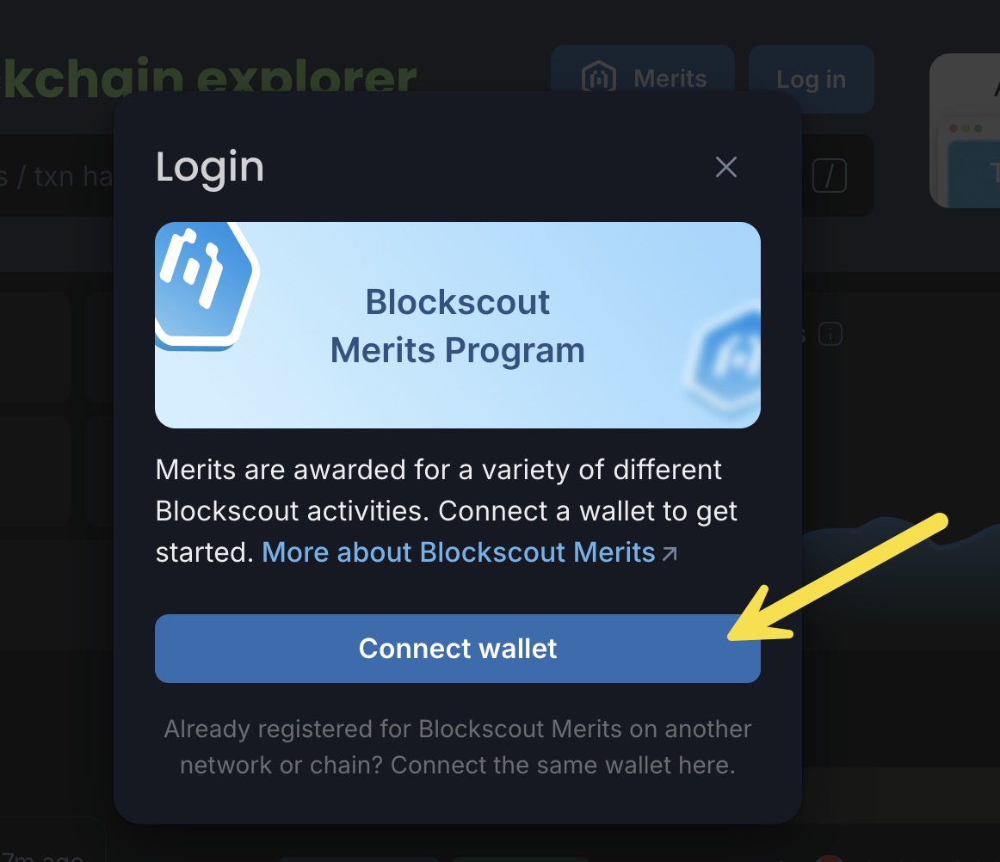<figcaption>
Click Connect wallet
</figcaption></figure>

If using a six digit referral code, you will go to the Blockscout instance and click on the Merits button to get started.

<figure>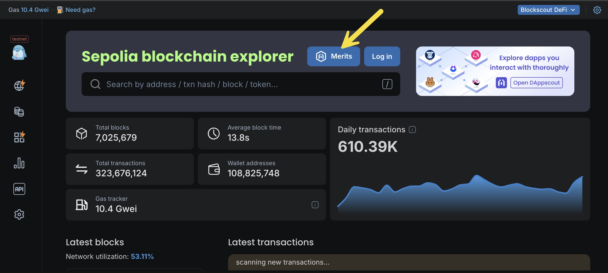<figcaption>
Desktop
</figcaption></figure>

<figure>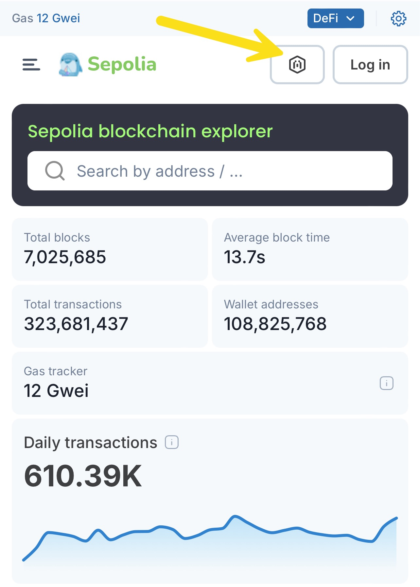<figcaption>
Mobile Blockscout Merits button
</figcaption></figure>

#### **2) Connect your wallet (EOA)**&#x20;

Note that this wallet can be used to collect Merits across chains.

<figure><figcaption>
Click Connect wallet
</figcaption></figure>

<figure>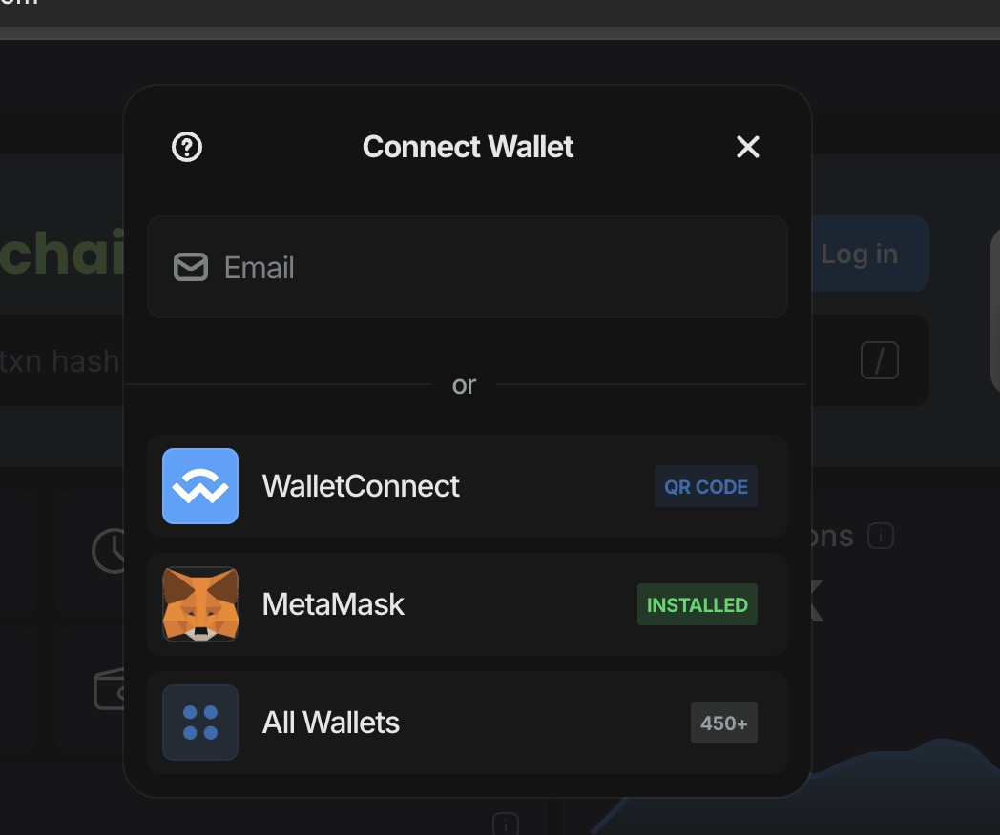<figcaption>
Choose your preferred method
</figcaption></figure>

<figure>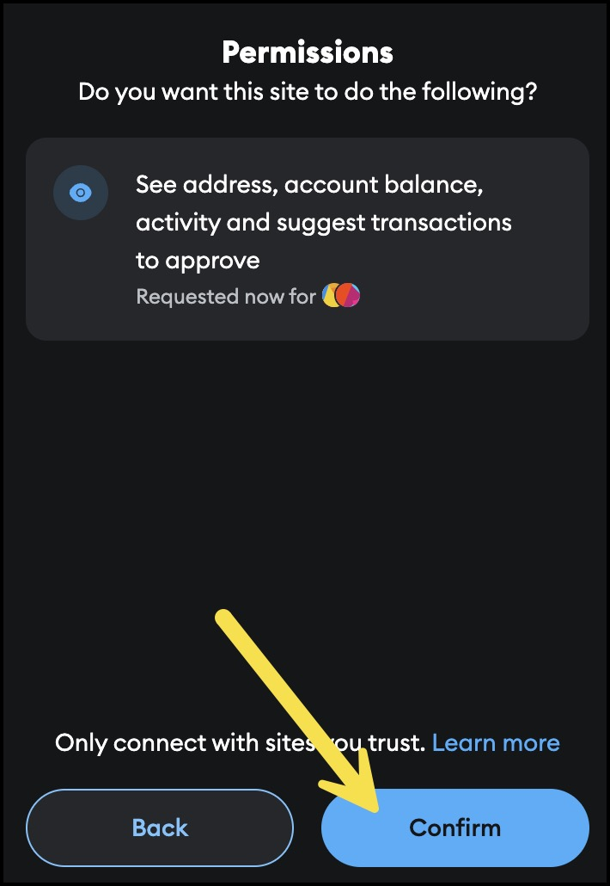<figcaption>
Grant permission to connect in your web3 wallet
</figcaption></figure>

#### 3) **Login to account**

Once you have granted permission to connect your wallet, you can login to your account. When confirming in your web3 wallet be sure to check that the site info and wallet info are correct _(in this example we are using a testnet, so the information will be different depending on the instance you are accessing)._

<figure>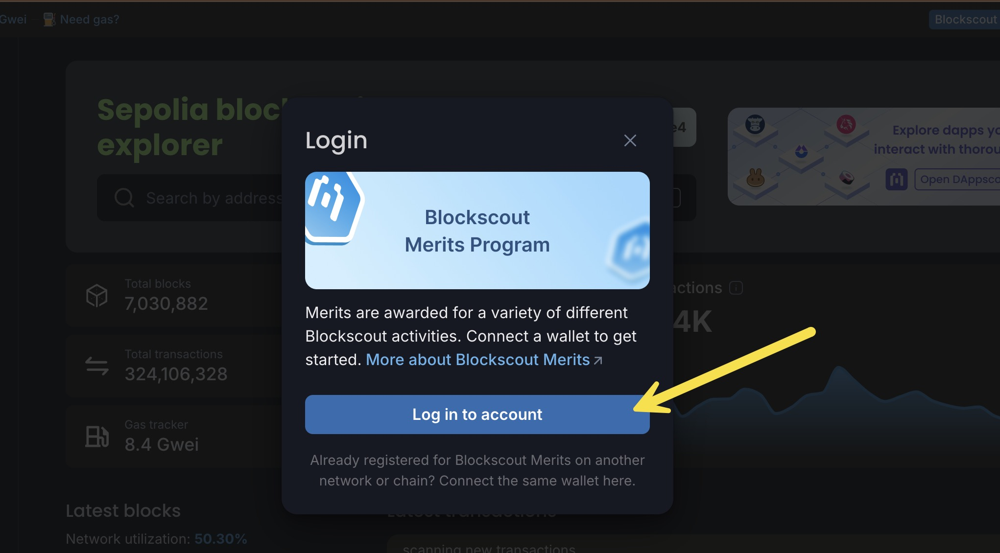<figcaption></figcaption></figure>

<figure>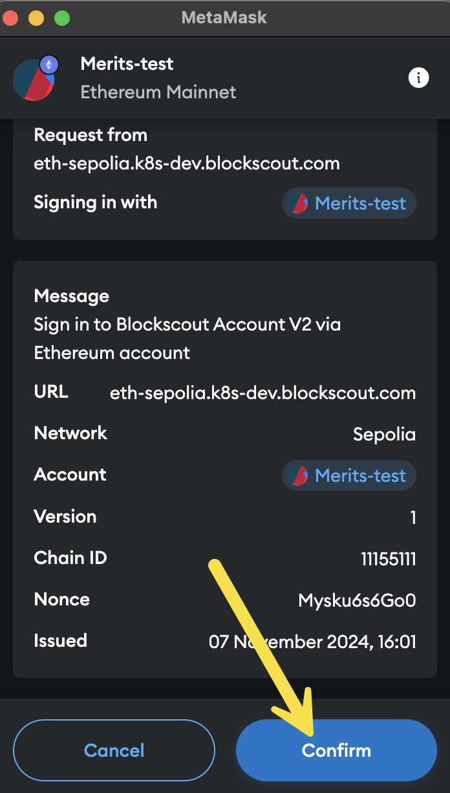<figcaption>
Confirm sign in with your wallet
</figcaption></figure>

#### 4) **Add email (optional)**

Add your email to enable account watchlist functionality and receive Merit updates.

<figure>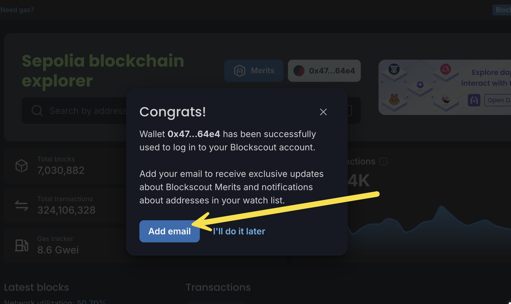<figcaption>
Add email
</figcaption></figure>

<figure>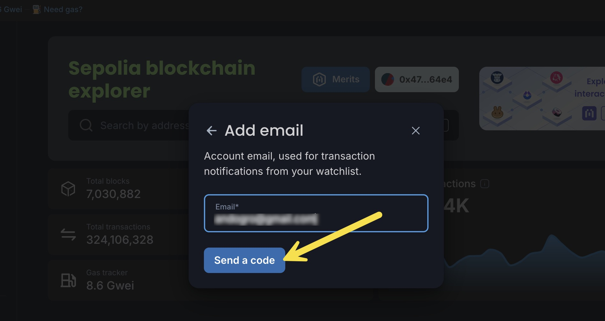<figcaption>
Enter your email and send the code
</figcaption></figure>

<figure>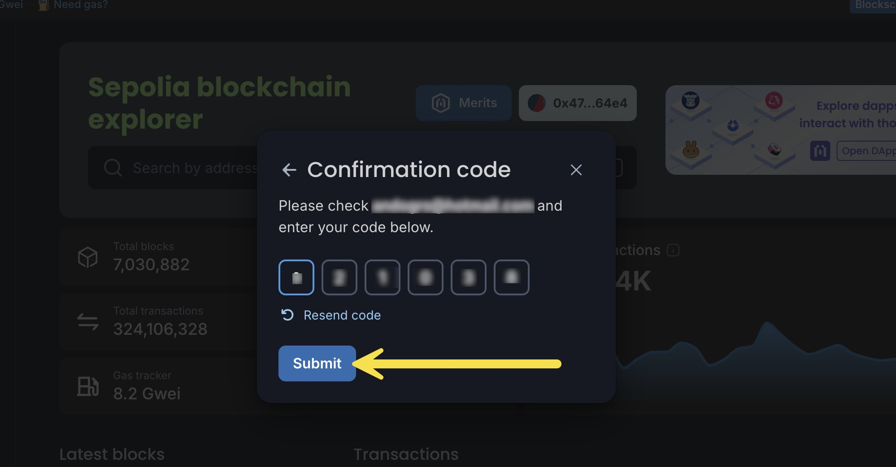<figcaption>
Enter the confirmation code. Check your spam box for the email w/the code if needed.
</figcaption></figure>

<figure>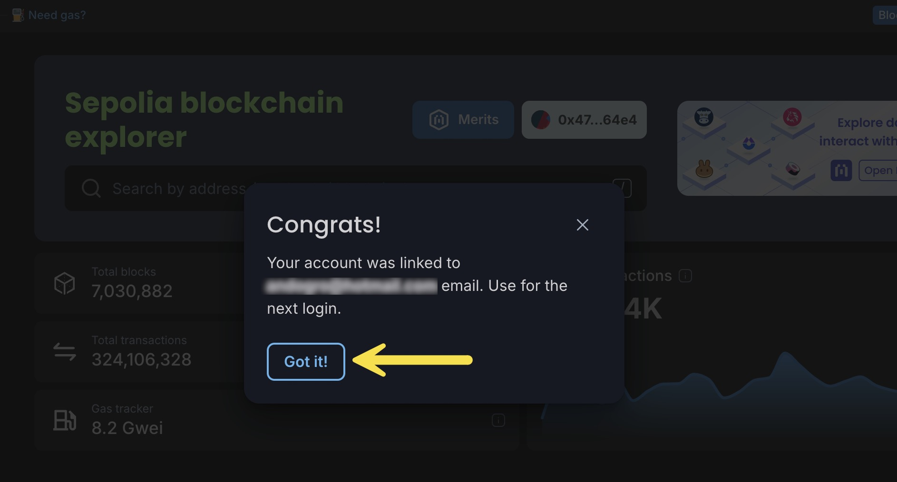<figcaption>
Click Got it! to continue
</figcaption></figure>

#### 5) Join the Merits program

Your code should pre-populate. Click Get started and confirm sign-in via your web3 wallet.

<figure>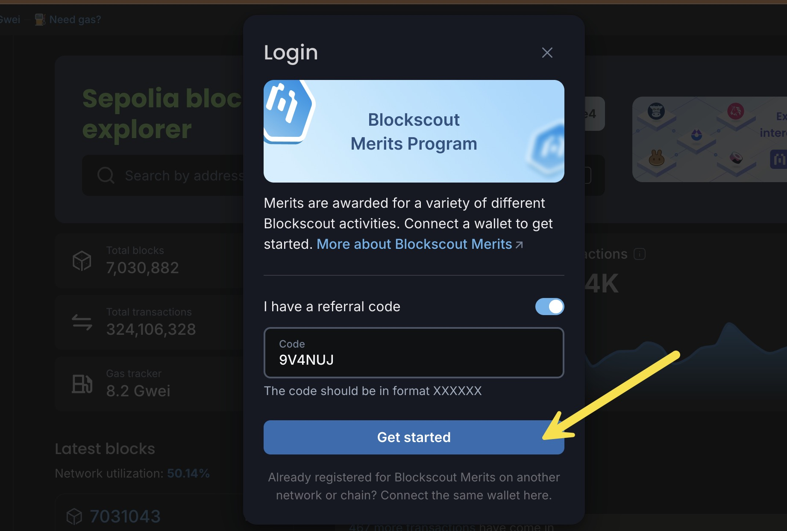<figcaption></figcaption></figure>

<figure>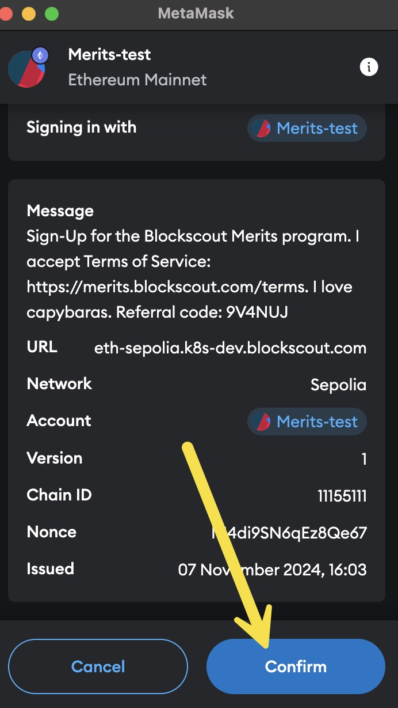<figcaption>
Confirm in your wallet 
</figcaption></figure>

#### 6) Congratulations!

You are now enrolled in the Merits program. You can share your referral link on X, or click Open to view the Merits dashboard.

<figure>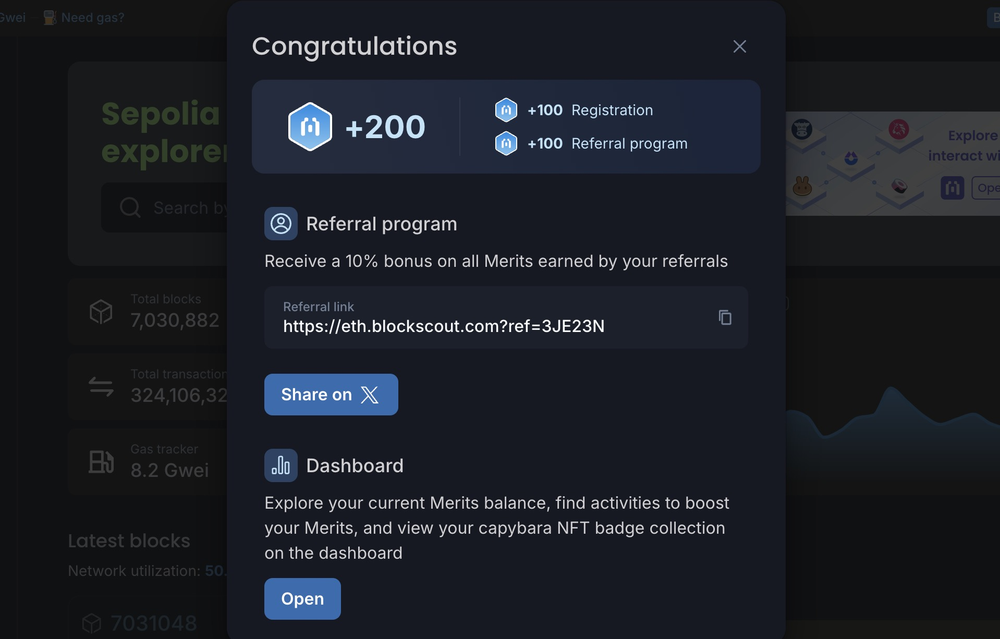<figcaption></figcaption></figure>

### New account signup (no referral)

We recommend using a referral code to receive additional Merits, however you can signup without one if desired. The flow is the same as the referral sign up with a code. The only difference is you do not toggle the I have a referral code button (step 5 above) to proceed.

<figure>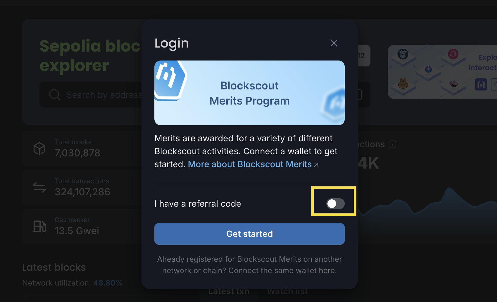<figcaption></figcaption></figure>

### Existing Account Signup

If you already have a Blockscout account, you can still use a referral code to sign up for the Merits program. Login to your Blockscout account and paste in the referral link or press the Merits button to start.  Follow the process above starting with step 5.&#x20;

<figure>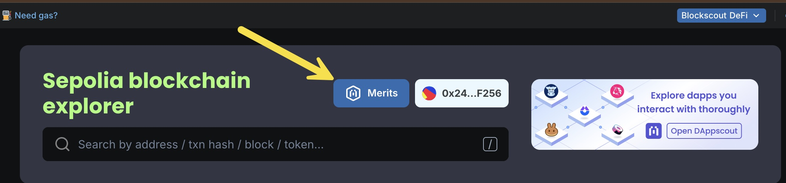<figcaption>
Press the Merits button once you are logged in if you have a six digit referral code
</figcaption></figure>

## Navigate the Merits dashboard

<figure>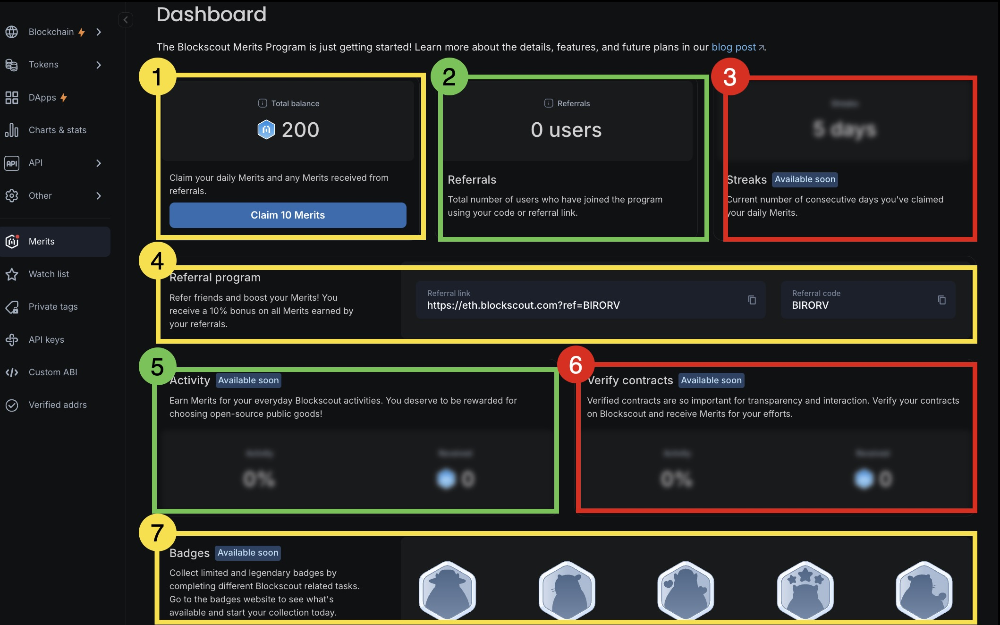<figcaption></figcaption></figure>

1. **Merits balance and claim**: Displays your current balance and claim eligibility. You can claim 10 Merits 1 time per day. This amount resets the following day.  The claim button will also send any available referral Merits to your account. Referral Merits are added when someone you refer completes an activity. Referrals are not available for signing up or daily claims.
2. **Referral data**: Shows how many individuals you have referred to the Merits program.&#x20;
3. **Streak data&#x20;**_**\<coming soon>**_: Shows how many days in a row you have claimed your daily Merits.
4. **Referral code and link**: Your referral link and code. Share this code with friends and they will receive additional Merits on signup. You will receive a 10% bonus for rewards earned by your referrals for Blockscout activity. More about referrals is in the [FAQ](faqs.md).&#x20;
5. **Activity tracking&#x20;**_**\<coming soon>**_: Tracks your activities and earned Merits for these activities.
6. **Contract verification tracking&#x20;**_**\<coming soon>**_: Tracks your contract verification activity and related Merits rewards.
7. **Badges&#x20;**_**\<coming soon>**_: Collection of the Blockscout badges you have earned for completing various Blockscout-based campaigns. For more information, see the [Blockscout Badges site](https://badges.blockscout.com/home).
