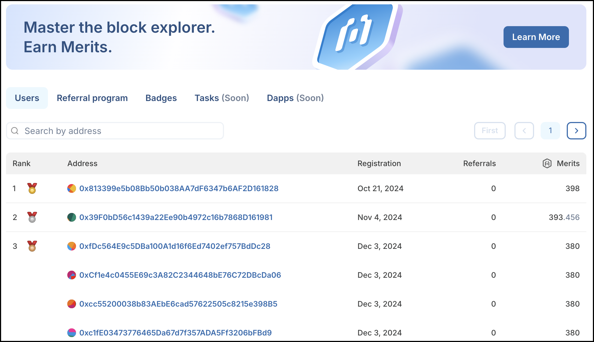
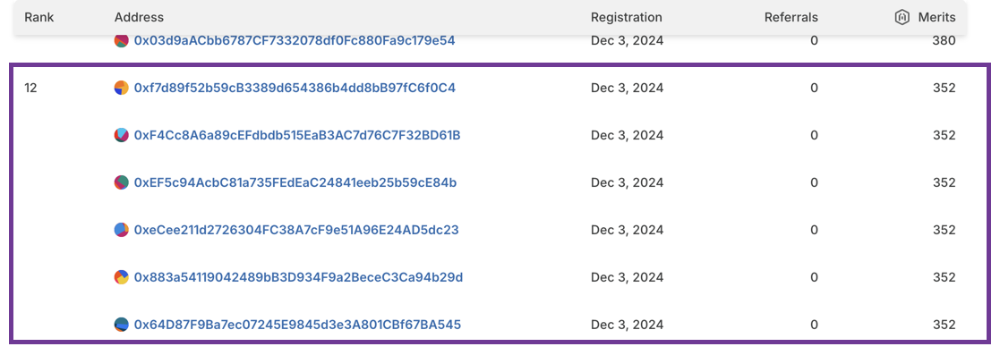

# Leaderboard


The Merits leaderboard is a part of the standalone Merits website launching soon.


The Merits leaderboard displays accounts ordered by the number of Merits each account has earned.&#x20;

<figure><figcaption>
Leaderboard with example data
</figcaption></figure>

* The leaderboard reflects the current season of earnings, and resets when a new season launches.
* Search is only available by the full address, but is not case sensitive.
* Ranking is determined by the number of Merits earned. If addresses share the same number of Merits, they all share the same rank. In this example, all accounts have 352 Merits, and are all ranked 12.

<figure><figcaption></figcaption></figure>
