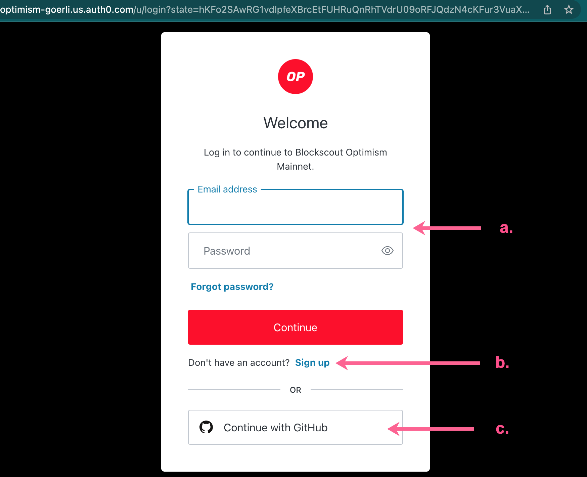
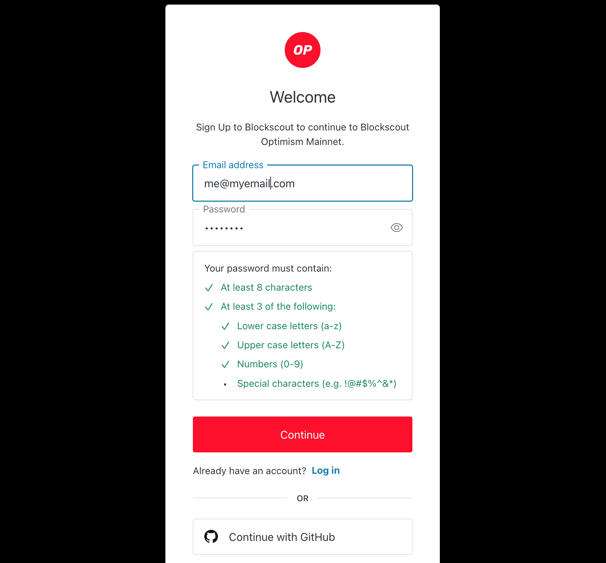
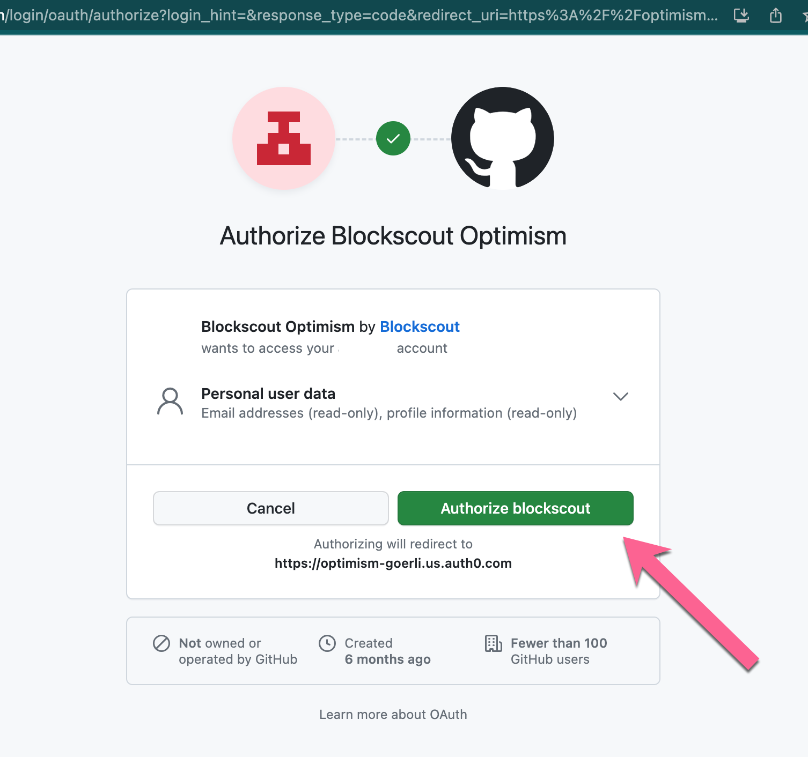
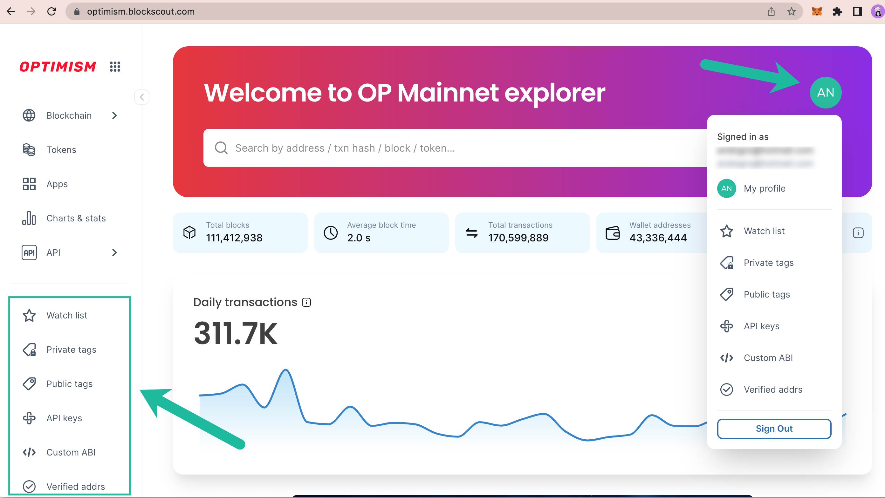

# My Account

The My Account feature provides the ability to watch addresses (and receive email notifications regarding activity), create private tags, add API keys to an account and more.

It does not contain any private key info or allow you to withdraw funds. It is designed as an organization and personalization tool for the block explorer, giving you additional ways to customize the data you want to receive.&#x20;

You can sign up for an account using either an email or your Github credentials.

The following options are currently available:

* **Watch list:** Watch specific addresses and receive email notifications for transactions.
* **Private Tags**: Private tags for addresses & transactions
* **Public Tags**: Request a public category tag displayed to all Blockscout users. Requests are processed manually.
* **API keys:** Add to receive an individually rate limited key.
* **Custom ABI**: Useful for testing & debugging, can be used with verified or unverified contracts.
* **Verified Addresses**: Verify ownership of a smart contract address to easily update information in Blockscout
* **Sign Out**: Sign out, info kept in local storage for easy sign-in.

Additional future features include an upcoming redesign and multi-chain rollout.

## Get Started


_The following example is created using the_ [_Optimism Blockscout instance_](https://optimism.blockscout.com/)_._


#### **1) Click the MyAccount Icon**

<figure><figcaption>
Generic My Account icon displays when you are not signed in
</figcaption></figure>

<figure><figcaption>
Mobile MyAccount icon
</figcaption></figure>

#### 2) Sign in / Create an Account

a. Sign in with your existing email and password\
b. Create a new blockscout account with an email/password\
c. Sign in with an existing github account

<figure><figcaption></figcaption></figure>

#### 2a) Email and Password&#x20;

Enter a valid email and password to setup an account. You will receive a validation notice to your email, be sure to check spam filters as it will come from _noreply@blockscout.com_.

<figure><figcaption>
Enter your email and a valid password
</figcaption></figure>

<figure><figcaption>
You will be forwarded to the verify page. Check your email to verify your new account.
</figcaption></figure>

<figure><figcaption>
Confirm your account from email. Email will come from noreply@blockscout.com
</figcaption></figure>

#### 2b) Github

<figure><figcaption>
Authorize blockscout access using your github account
</figcaption></figure>

#### 3) View Options

Once logged in, you can view options in the My Account Dropdown or on the activated toolbar.

<figure><figcaption></figcaption></figure>
