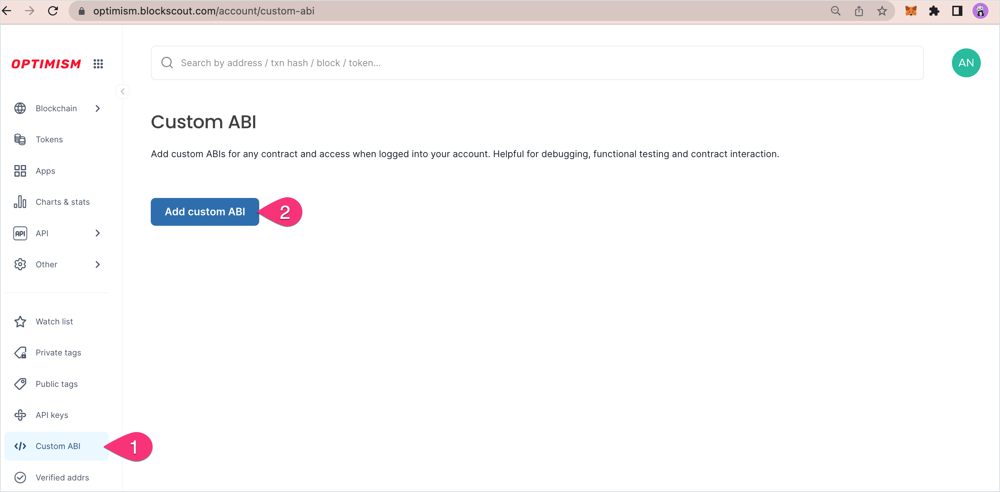
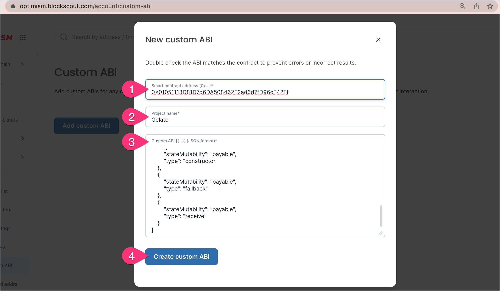
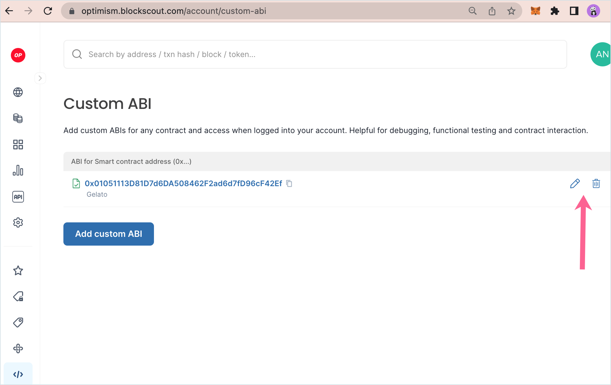
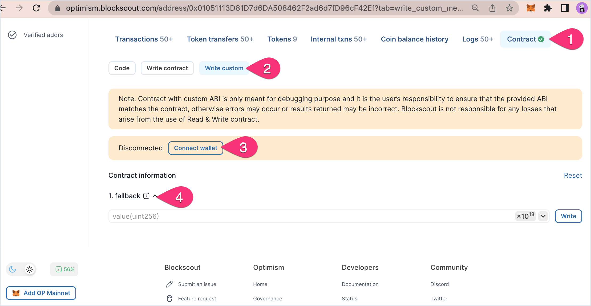

# Custom ABI

The Custom ABI feature is useful for debugging and testing newly deployed smart contracts. This feature can be used with verified or unverified contracts.

Once a custom ABI is added, the user can test methods using the `Write Custom` feature.

## Add Custom ABI

**1)** [Login to My Account](./) in Blockscout to get started. Once logged in:

1. Go to **Custom ABI** in the My Account menu.
2. Press the **Add Custom ABI** button.

<figure><figcaption></figcaption></figure>

**2)** **Fill in the fields**.

1. **Smart Contract Address**. Enter the correct `0x` address of the deployed contract.
2. **Project Name**.  Create a name for your own reference.&#x20;
3. **Custom ABI**: Copy and paste in the ABI for the contract from your development environment (truffle, hardhat, remix etc) or if the contract is verified you can copy from Blockscout.
4. Press **Create custom ABI**.

<figure><figcaption></figcaption></figure>

**3) Custom ABI added** to the home screen. You can edit or remove current custom ABIs or add additional custom ABIs from here.

<figure><figcaption>
Edit or delete a custom ABI using the icons
</figcaption></figure>

## Interact with a Custom ABI

You will need to be logged into My Account to interact with your custom ABIs. Once you added, you can visit the contract to interact with the custom ABI.

1. Go to the contract page.&#x20;
2. You will see a Write custom button.
3. Connect your wallet to interact with the contract.
4. Write to the available methods.&#x20;

<figure><figcaption></figcaption></figure>

