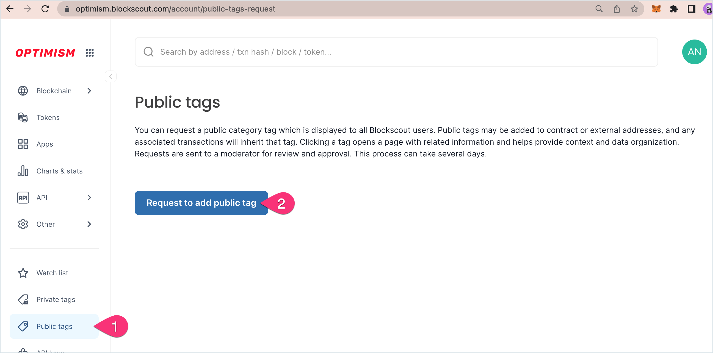
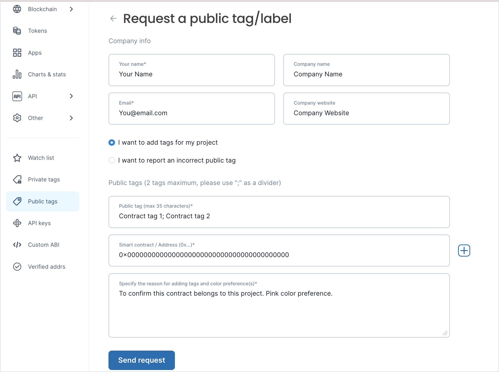
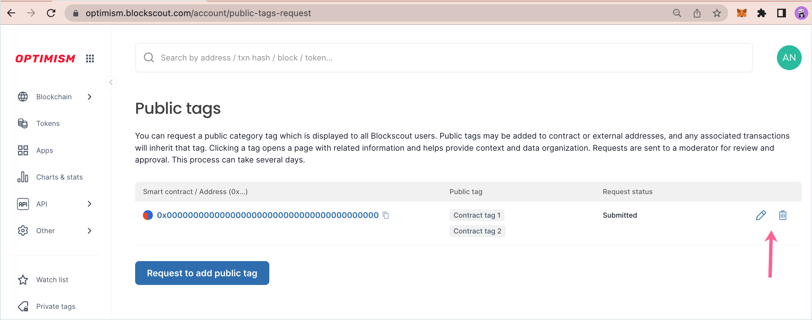

# Public tags

Request a public tag for your project's contracts on the public Blockscout instance. Tags appear in search, help create brand awareness for projects, and make exploration easier.

Once submitted, tags are reviewed and accepted/denied manually by the instance admin. If accepted, the tag is added to the public instance. It is also possible to report incorrect public tags through the public tags section.


_The following example is created using the_ [_Optimism Blockscout instance_](https://optimism.blockscout.com/)_._


## Request Public Tags

**1)  Login to** [**My Account**](./)

1. Go to **Public tags** in the My Account Menu
2. Press **Request to add public tag**.

<figure><figcaption></figcaption></figure>

**2)** **Fill in the fields**. Fields with \* are required.

* Your name\*
* E-mail\*
* Company name
* Company website
* Select either:
  1. I want to add tags for my project
  2. I want to report an incorrect public tag
* Public tags\*: 2 tags max, 35 character max per tag, use the ; as a separator
* Smart contract / Address (0x...)\*: Provide the 0x address of the contract. If you have several, press the "+" to add.
* Reason and Description\*: Add any relevant details and include your color preference for the tags. Include any other helpful or clarifying information here.

<figure><figcaption></figcaption></figure>

**3) Public tag request added** to the Public tags home screen. You can edit, request additional tags or delete old tags from here. Public tags are reviewed manually and can take some time in the queue.  If your tag request appears in the dashboard it has been successfully submitted and will be reviewed in the order in which it was received.

<figure><figcaption>
Use the icons to edit or delete your public tag request
</figcaption></figure>

