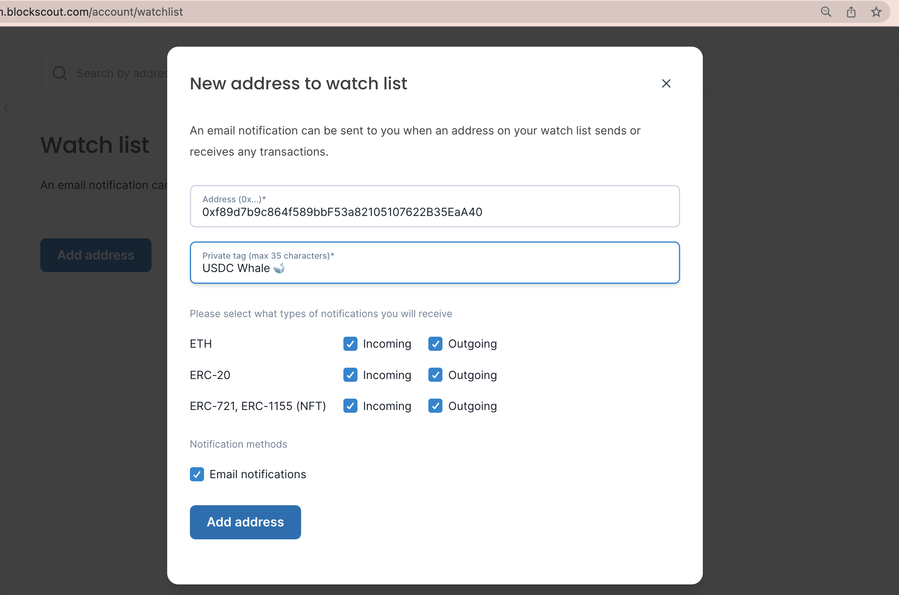
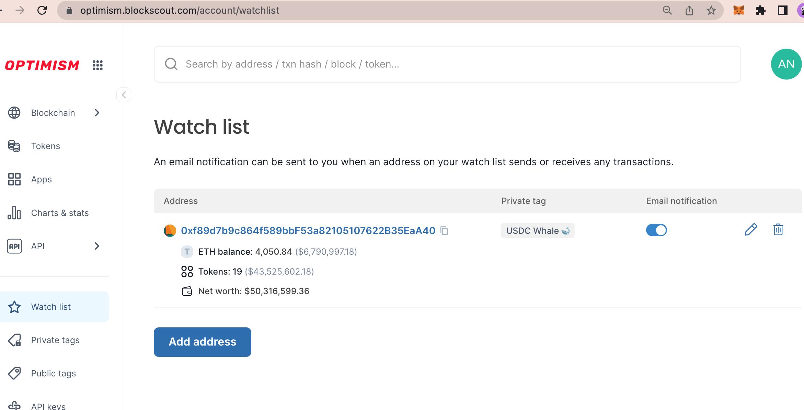
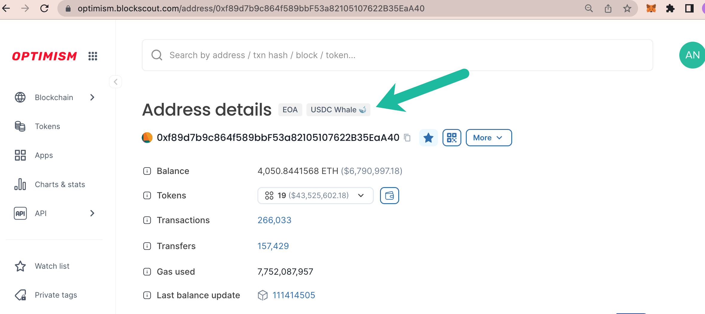

# Watch list


_The following example is created using the_ [_Optimism Blockscout instance_](https://optimism.blockscout.com/)_._


Sign up for email notifications for different actions related to an EOA or contract address. This can include incoming/outgoing transactions for native tokens, ERC-20 tokens or NFTs like ERC-721 and ERC-1155s.

1\) **Login to My Account in Blockscout** <[_login instructions_](./)> . From the Watchlist menu click Add address.

<figure><figcaption></figcaption></figure>

2\) **Fill in information** including:

* **Address**: 0x address of the EOA or contract to watch.
* **Private tag**: For your reference, will be displayed as a private tag for your Blockscout instance when you are logged in (emoji's accepted 🙂)
* **Notification types**: Select which types of transactions you would like to receive email notifications for. These include native tokens (in this case ETH), ERC-20 tokens, and NFT tokens.
* **Email Notifications**: Select to receive.
* **Add address**: Click button to add to your watchlist.

<figure><figcaption></figcaption></figure>

3\) A new address along with an info overview will be added to your watchlist dashboard. You can edit info, remove, or add more items.

<figure><figcaption></figcaption></figure>

4\) Click the address to view in the Blockscout console. Watch list addresses show the private tag when logged into My Account.

<figure><figcaption></figcaption></figure>

5\) If selected, you will receive emails based on actions completed by this address.

<figure><figcaption></figcaption></figure>

