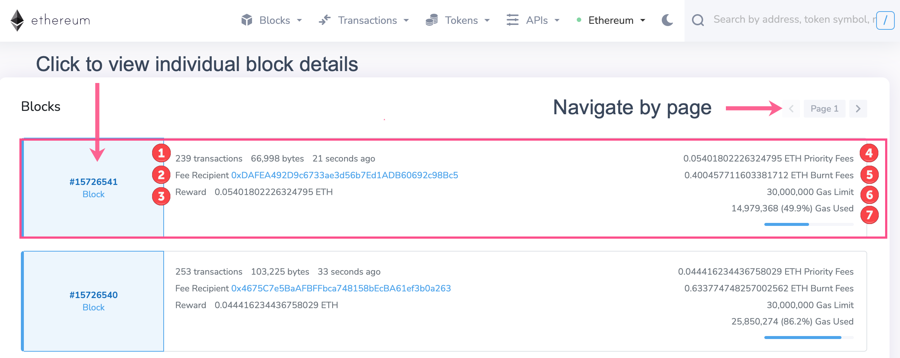
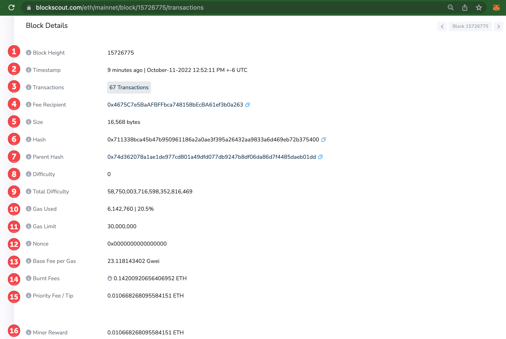
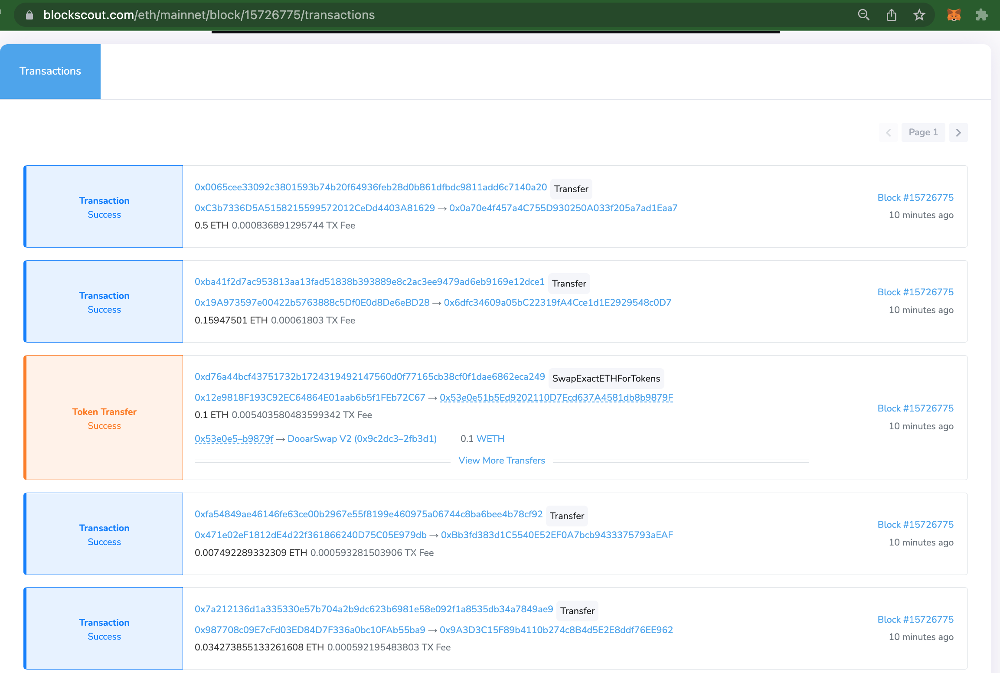

# Blocks

Blocks update on the homepage as they are created with basic information including block number (block height), number of transactions in the block, and time since the block was created.&#x20;

Click on a specific block number for information about that block, or **View All Blocks** for a more detailed overview of recent blocks.&#x20;

The all blocks page can also be accessed from the top menu.


Blockscout displays are configurable and may show different information depending on the instance and/or consensus method. These examples use a V1 instance of the UI. **V2 views are in process.**


<figure><figcaption></figcaption></figure>

## View All Blocks

The view all blocks page shows updated details from the most recent blocks. Use the page arrows to navigate&#x20;

<figure><figcaption></figcaption></figure>

#### Details by line

1. Number of transactions in the block / size of block in bytes / time since block was created.
2. Validator appending the block to the chain (fee recipient).
3. Reward to validator (in ETH). Equals the amount of priority fees sent by users to include transactions in the block.
4. Same as (3).
5. Portion of tx fee (in ETH) burned due to EIP-1559. Amount burned = `baseFeePerGas * gasUsed`
6. Block Gas limit. On Ethereum this is 30M gas: 2x the target size of 15M.
7. Amount of gas used in the block (amount and % of block space used). The blue line visualizes the %.&#x20;

## Individual Block Page

Click on a block number (this number, also referred to as block height, indicates how many blocks have been added to the chain) to view additional details about the block. Scroll down to view individual transactions contained in a block.

Click on the tooltip (i) next to each item to view relevant info.

<figure><figcaption></figcaption></figure>

1. **Block Height**: Also known as block number, shows the position of the block on the chain.&#x20;
2. **Timestamp**: Time & date the block was produced.
3. **Transactions**: Number of transactions included in the block.
4. **Fee Recipient**: Address of the validator (block producer) that received priority fees. Copy the address with the blue icon and paste into search to find more details about this validator.
5. **Size**: Size of the data contained in the block in bytes.
6. **Hash**: Cryptographic hash of the block header.
7. **Parent Hash**: Hash of the preceding block.
8. **Difficulty**: _NA for PoS. W_ork required to mine a block in PoW.
9. **Total Difficulty**: _NA for PoS._ Total difficulty to mine the chain up until this block.
10. **Gas Used**: Total amount of gas used in the block & % of filled space.
11. **Gas Limit**: Total gas limit for the block. 30M is Ethereum limit, which represents 2x the 15M target.
12. **Nonce**: _N/A for PoS_. Demonstrates work in PoW.
13. **Base Fee per Gas**: Minimum multiplier required for a transaction to be included in a block.&#x20;
14. **Burnt Fees**: Amount of ETH burned in the block.
15. **Priority Fee/Tip**: Total tips for transactions included in the block
16. **Miner Reward**: Amount received by fee recipientin PoS. Matches (15).

Scroll below the block details to view transactions contained within the block.

<figure><figcaption></figcaption></figure>

