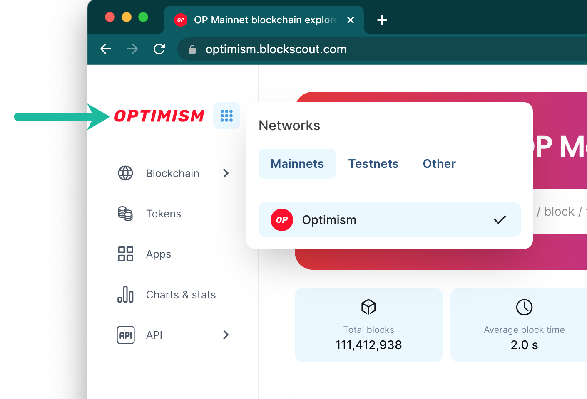
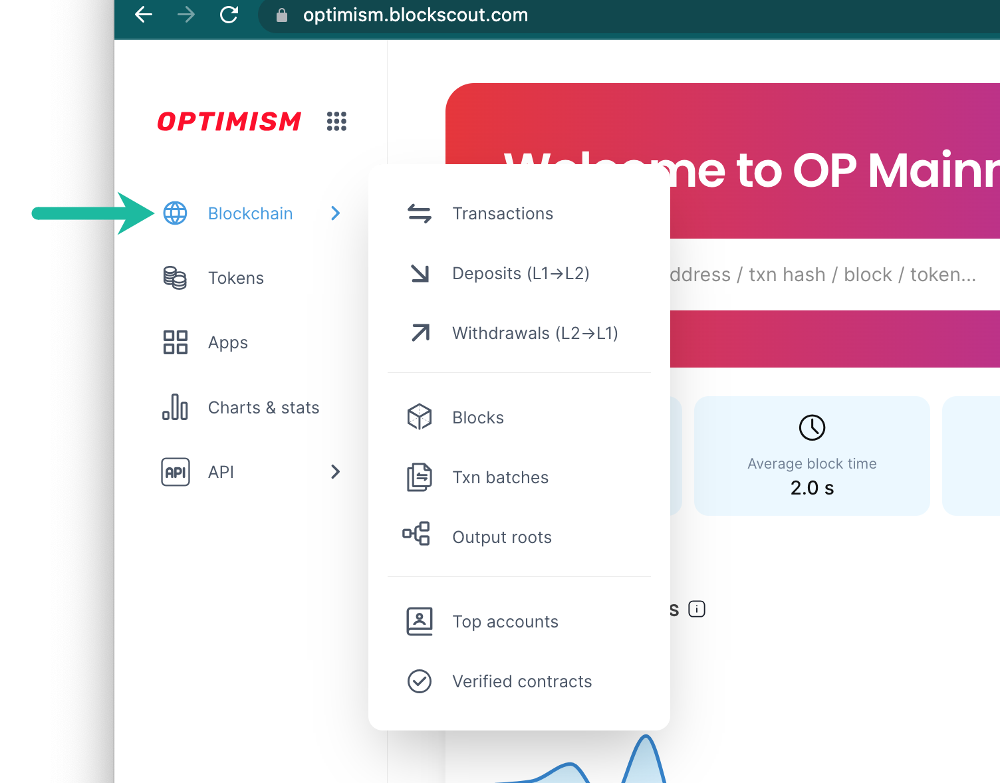
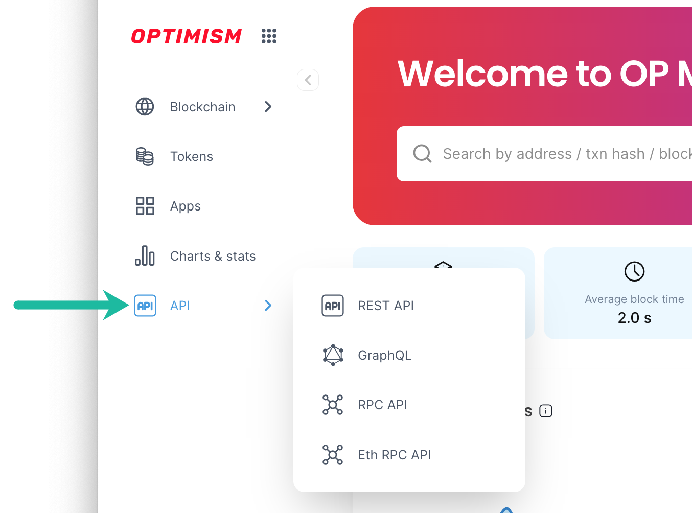
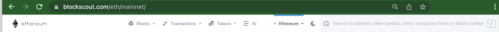
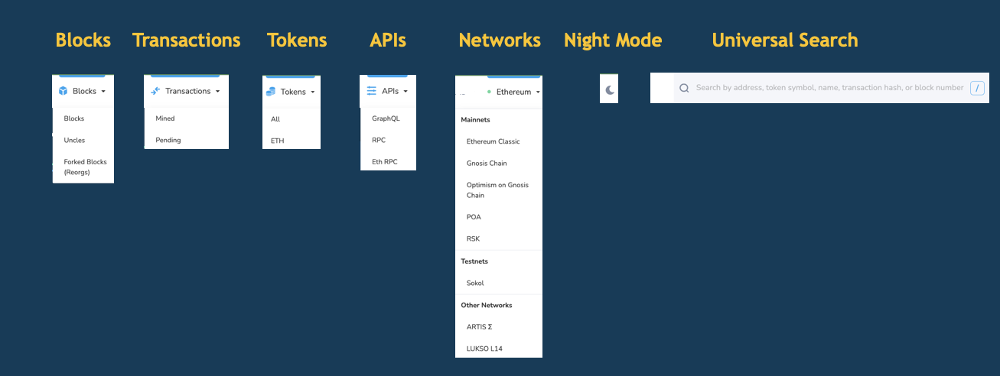
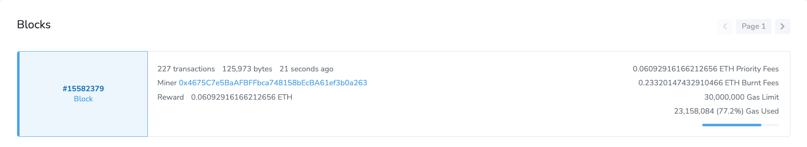
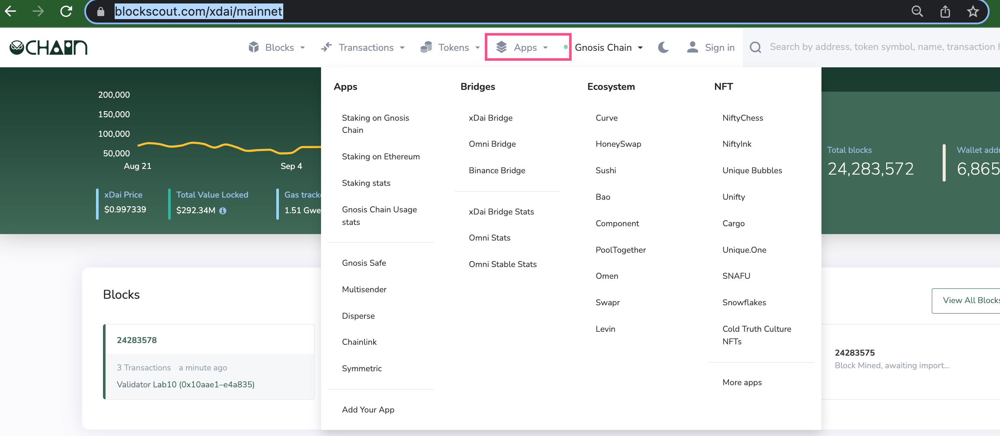
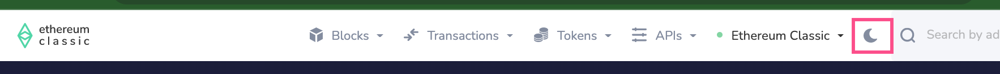

# Main Menu

## V2 UI


_The following views are taken from the_ [_Optimism Blockscout instance_](https://optimism.blockscout.com/)_._


### Network Menu

Shows available Mainnet and Testnets.

<figure><figcaption></figcaption></figure>

### Blockchain Menu

Access transactions, blocks, batches and L1 <-> L2 data.

<figure><figcaption></figcaption></figure>

### API Menu

Access API information including the REST API which serves the v2 UI.

<figure><figcaption></figcaption></figure>

## V1 UI

Many projects still use the previous Blockscout UI, and info below relates to the previous v1 UI. We encourage projects to [upgrade to the new U](../../setup-and-run-blockscout/deployment/frontend-migration/)I.

## Top Menu

The top menu contains navigational items for exploration. The menu is customizable, and different instances can have different menus depending on the needs of the chain.

<figure><figcaption>
Ethereum Mainnet Menu
</figcaption></figure>

<figure><figcaption>
Expanded Items
</figcaption></figure>

## Blocks

* **Blocks:** Access high-level data for blocks, beginning with the most recent.\
  
* **Uncles:** Not valid for PoS consensus (but available for PoW consensus chains such as Ethereum Classic), uncles are created when 2 blocks are mined at the same time. Only 1 block can be added to the chain, and Uncles are the blocks that are not added, but miners still receive rewards for these blocks.
* **Forked Blocks (Reorgs):** Blocks which are not included in the primary chain due to chain reorganizations.

## Transactions

* **Mined**: Transactions which have been added to the chain, either by validators or miners depending on the chain type.
* **Pending**: Transactions still in the mempool which are waiting to be mined. These transactions may be mined or excluded depending on gas fees or network congestion.

## Tokens

Token menu is often configured differently depending on the instance.

* **All:** A list of ERC-20 tokens deployed to the chain.
* **Native** (ie **ETH** on mainnet): Displays native token holders, ordered by balance.
* **Bridged**: If a chain includes bridged tokens (ie [Gnosis Chain](https://gnosis.blockscout.com/)) these can be catalogued here.

## APIs

* **GraphQL**: Explore API calls using GraphQL and the in-browser IDE. Learn more about the [GraphQL Blockscout integration here](../../devs/apis/graphql.md).
* **RPC**: API supporting GET and POST requests for many different API calls.
* **Eth RPC**: Supports the most popular [JSON RPC methods.](https://ethereum.github.io/execution-apis/api-documentation/)

## Apps

Customizable menu that can link to different ecosystem applications, utilities and statistics. [Gnosis Chain](https://gnosis.blockscout.com/) currently has the most robust example of the Apps menu.

<figure><figcaption></figcaption></figure>

## Networks

The current network name along with a dropdown displaying available instances. Self-hosted chains may choose to only show their Mainnet and testnets. Hosted instances typically include links to other Hosted instances including Ethereum, Ethereum Classic, and Gnosis Chain.

## Night Mode

Switch to a dark background using the night-mode toggle.

<figure><figcaption></figcaption></figure>

## Search Bar

The comprehensive search bar allows for search by address, token name, token symbol, transaction hash, block number, tag or project name. It is typically the easiest way to find data quickly, and populates with inline results as you type.

## Custom Project Logo

Also included in the top menu is the Project logo. Projects can add and change custom logo using ENV variables during deployment. [More info here](../../setup-and-run-blockscout/configuration-options/branding-configs.md).

<figure><figcaption></figcaption></figure>
