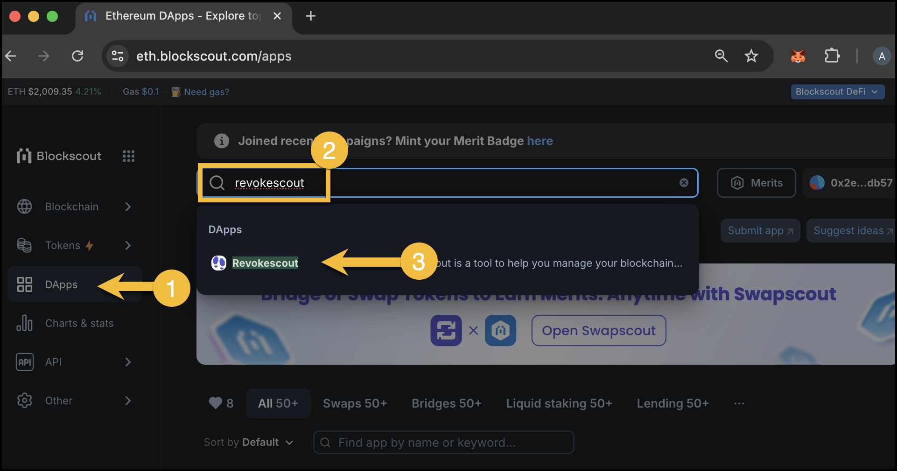
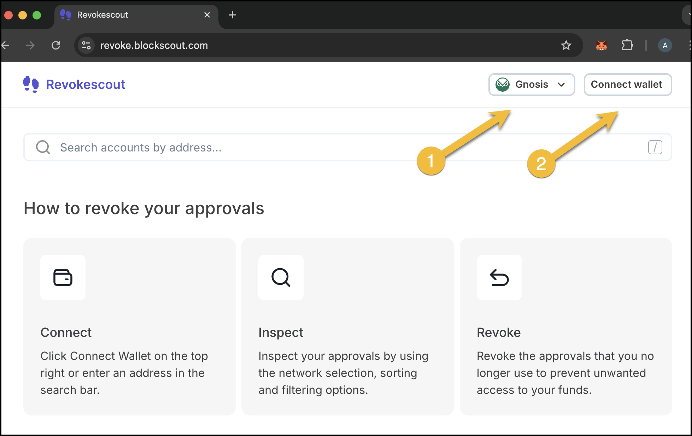
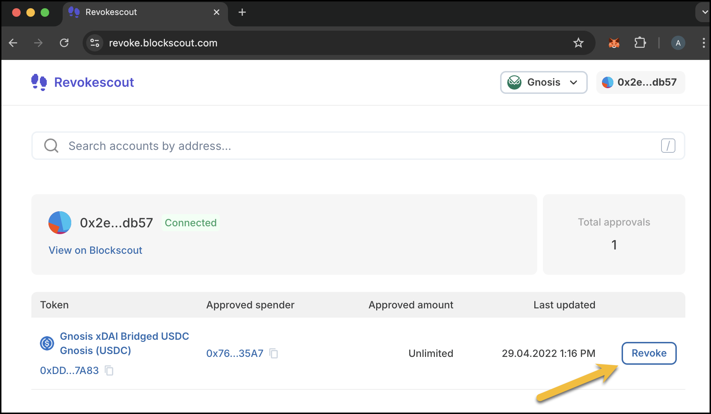
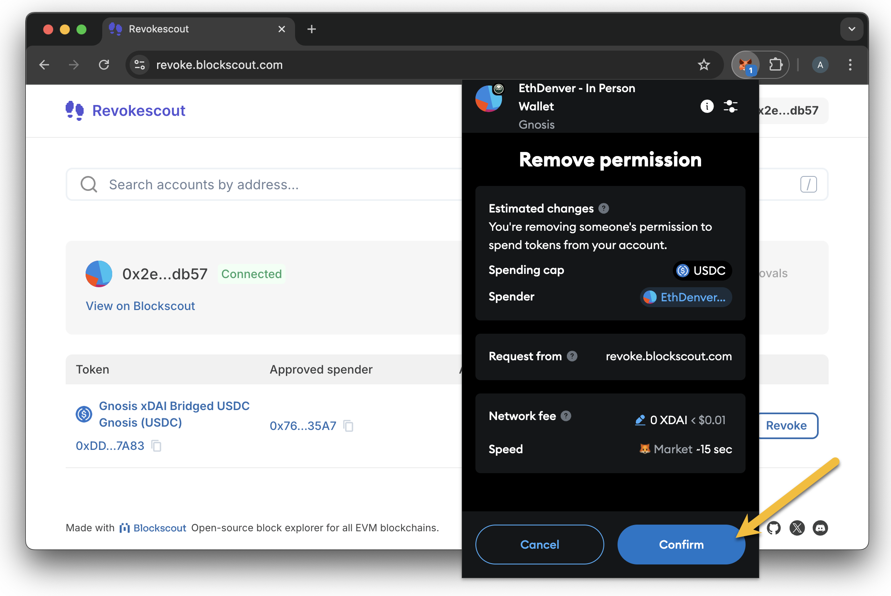
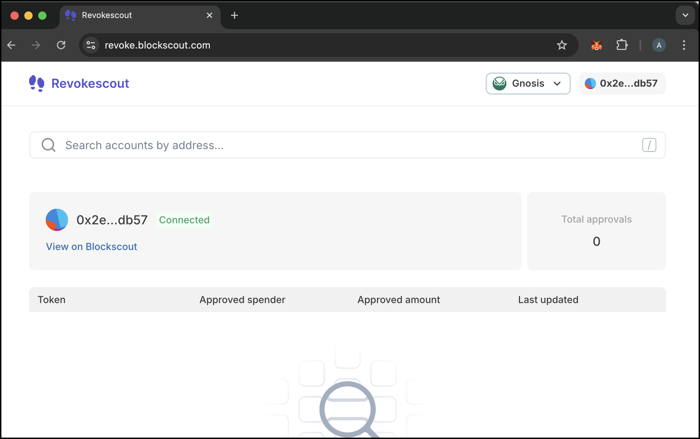

# Revokescout


**Find Revokescout now at** [**https://revoke.blockscout.com/**](https://revoke.blockscout.com/) **or search via the Dappscout marketplace.**


Many applications require you to grant approvals so that their contracts can interact with tokens in your wallet. This can be a security issue if you have granted unlimited or high allowances, or have granted approvals and forgotten about them. If an application is hacked or misused in some way, this can result in funds being quickly drained from your wallet.&#x20;

Revokescout lets you manage your approvals from a single interface. Easily check, update, and revoke token allowances you may have granted to different applications.&#x20;

## Access the App

Revokescout can be accessed directly at [https://revoke.blockscout.com/](https://revoke.blockscout.com/) or as an app via the Dappscout interface in Blockscout on supported chains.


Revokescout currently supports a subset of chains including Ethereum, OP Mainnet, Gnosis, Base and Ink.&#x20;


<figure><figcaption>
Accessing Revokescout via the Dapps menu
</figcaption></figure>

## Check and Revoke

1\) Select the chain you want to check.

2\) Connect the wallet you want to revoke allowances for.

<figure><figcaption></figcaption></figure>

3\) Review any allowances and click the Revoke button for those you want to revoke.

<figure><figcaption></figcaption></figure>

4\) Confirm the transaction in your web3 wallet. This does not require any gas or transaction fees.

<figure><figcaption></figcaption></figure>

5\) Your permissions will update momentarily.

<figure><figcaption>
Success message - takes a moment for permssion to be removed from UI
</figcaption></figure>

<figure><figcaption>
Permssions updated
</figcaption></figure>

## **FAQ**

<strong>Why can’t I see the “Value at Risk” for the approved amount?</strong>

This usually happens when the price information in USD is not available for a particular token. In these cases, the token amount is displayed without an associated USD conversion.&#x20;

<strong>Can I revoke multiple approvals at once?</strong>

Not yet. We’re still working on this functionality, and it will be added in future releases.

<strong>Can I use a hardware wallet with Revokescout?</strong>

Yes, you can use any wallet that **WalletConnect** supports.

<strong>Why should I revoke access to my tokens?</strong>

It’s always a good practice to **limit token approvals** when you’re not actively using a dapp, especially on **NFT marketplaces**. This reduces the risk of losing funds due to hacks or exploits and helps mitigate the damage caused by phishing scams.

<strong>Why should I use Revokescout?</strong>

Revokescout is designed to provide valuable insights about your tokens and account. Instead of only allowing you to revoke token approvals, we offer a **comprehensive overview** of spender accounts. This way, you can make informed decisions and better understand **who has access** to your tokens.

## **Roadmap**

1.  **Public Tags**

    We plan to highlight key information about **approved spender contracts**, ensuring users are aware of **who has access** to their tokens. If an approved spender gets hacked or is flagged as a scam, this information will be added to Blockscout, allowing users to react promptly.
2.  **Sorting**

    To improve user experience, we’re introducing sorting options for approvals. Users will be able to sort approvals by **amount, date, and value at risk**.
3.  **Bulk Revoke for Multiple Tokens**

    We’re working on adding a **multi-token revoke feature** in upcoming releases to speed up the process.
