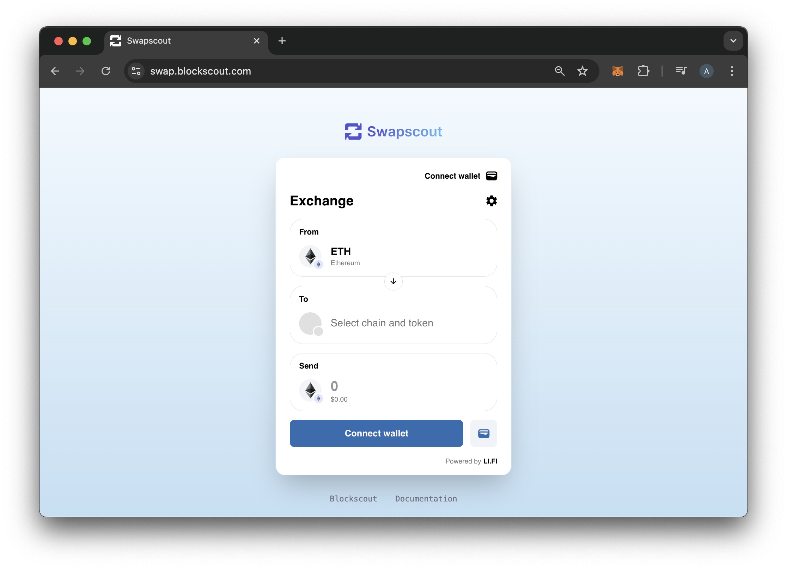
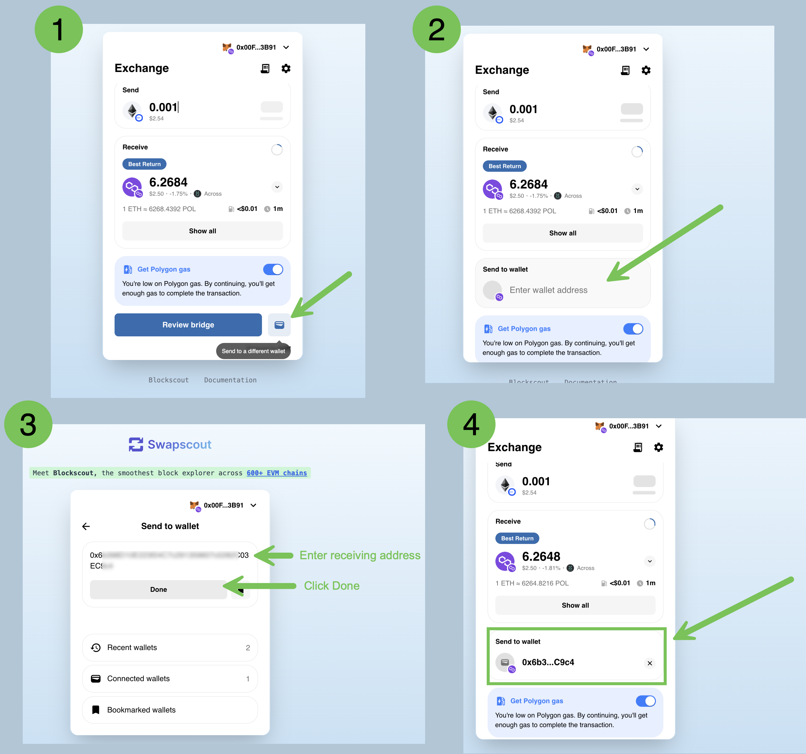

# Swapscout

Simple swaps and cross-chain bridging transactions are now available via the dedicated Swapscout swap app. The application is powered by [LI.FI](http://li.fi/),  providing a flexible and lightweight interface for swapping and bridging. Blockscout has integrated the LI.FI widget to create a convenient and user-friendly tool specifically for Blockscout users.&#x20;


**Find Swapscout now at** [**https://swap.blockscout.com/**](https://swap.blockscout.com/)


<figure><figcaption></figcaption></figure>

## Swapscout Features

* **Simple interface for swapping and bridging**. Swapscout is a convenient, easy-to-use tool for your token management and exchange needs. The clean, straightforward interface is designed for fast and intuitive token exchanges.&#x20;
* **Flexibility with tokens, chains, and addresses**. Swapscout currently supports operations on 8 blockchains including Ethereum, Arbitrum, Base, zkSync, Polygon, Polygon zkEVM and Gnosis. Swap and bridge operations can be initiated by 1 address and sent to the same address or a different address if desired. If the address receiving a token does not have enough gas tokens to cover fees, a portion of the swap can be converted to automatically cover gas costs.
* **Low integrator fees**. Swapscout offers extremely low fees (.075%) on swaps. For example, a $1,000 swap incurs a $0.75 fee.
* **Aggregator fetches the best prices**: The application checks across 32 exchanges and 19 bridges to find the best swap and bridge prices, along with options for different routes if you want faster bridging or prefer to use a specific app or bridge.
* **Li.Fi for consistency and security:** Swapscout uses Li.Fi under the hood to provide swap and bridging functionality. This audited codebase is used throughout the ecosystem and trusted by many projects to provide safe and secure transfers.&#x20;

## Swapscout Operations

### Connect a wallet

1. Click connect wallet
2. Choose your preferred wallet and connect



### Swap tokens on the same chain

Swapscout checks up to 32 exchanges and aggregators to find the best routes for a swap. In this example USDC is traded for a meme token on Base.



### Swap and bridge tokens from 1 chain to another

In this example we swap xDai on Gnosis for USDC on Base. Depending on the token and chain there may be several routes. Check routes for pricing and timing that best suits your needs.



### Swap, bridge and send tokens to another wallet

The above video shows you how to swap and bridge from one chain to another. To send to a different wallet, click the wallet icon and enter the wallet address where you are sending funds.

<figure><figcaption></figcaption></figure>

